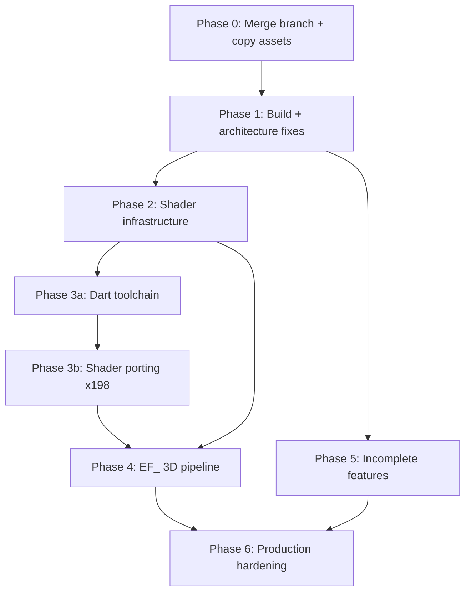

# Metal Renderer — Completion Plan (Reassessed)

## Current State of the Port (updated)

The core infrastructure, pipeline, and toolchain are now implemented. Remaining work is shader compilation/validation and the `.crycg` technique-pass parser for vertex pairing.

**Completed since initial assessment:**
- `EF_StartEf`, `EF_AddEf`, `EF_EndEf3D` — fully implemented (sort buckets, PSO lookup, draw loop)
- `PrepareDepthMap` — shadow encoder, `DrawEntity` loop, restore pass
- `generated_manifest.json` — exists (589 entries, 23% with `vertexEntryPoint`)
- `tools/shader_port/` Dart toolchain — 995 generated `.metal` files, manifest, unit tests
- Fragment uniform slot conflict — resolved; per-shader uniforms at slots 2/5, global at 0/2
- `xcrun metal` — available (Xcode 16.4); CMake detection fixed to use `xcrun` first

**Remaining open items:**
- Shader compilation validation — all `p3-shader-*` need CMake reconfigure + build + visual test
- `p3-manifest-pairing-crycg` — 76% of fragment entries lack `vertexEntryPoint`; requires `.crycg` technique parsing in `parser.dart`

---

## What Already Exists (working or nearly working)


| Area                                                | File                                            | Real status                                               |
| --------------------------------------------------- | ----------------------------------------------- | --------------------------------------------------------- |
| Metal device, CAMetalLayer, triple-buffer semaphore | `MetalBaseRenderer.mm`                          | Working                                                   |
| PSO cache, depth/stencil, sampler caches            | `MetalStateCache.mm/.m`                         | Working                                                   |
| Vertex descriptors for all VERTEX_FORMAT_*          | `MetalVertexDescriptor.mm`                      | Working                                                   |
| Texture DDS/BC load+upload, font, env cubemap RT    | `MetalTextureManager.mm`                        | Working with gaps (TGA/JPEG assert, packed formats wrong) |
| Buffer pools, indirect encoder                      | `MetalOptimizations.mm`                         | Working                                                   |
| 2D image/sprite rendering                           | `MetalUtilityRenderer.mm`                       | Partial (angle assert, text thin, no lines/balls)         |
| Basic shaders (7 effects only)                      | `UtilShaders.metal`, `SpriteShaders.metal`      | Working for basic cases                                   |
| CMake macOS build system                            | Per-module `CMakeLists.txt`                     | Present, generator expressions broken                     |
| macOS platform layer                                | `CryCommon/MacOSspecific.h`, `platform_macos.h` | Present                                                   |
| macOS input/sound/filesystem/events                 | Various CryXxx/MacOS*                           | Present                                                   |
| Shader loader architecture                          | `MetalShaderLoader.mm`                          | ✅ Manifest present (589 entries); function constants wired |
| EF_ render pipeline (3D geometry)                   | `MetalShaderManager.mm`                         | ✅ Implemented — sort buckets, PSO lookup, draw loop      |
| Shadow map depth rendering                          | `MetalRenderer.mm`                              | ✅ Shadow encoder + DrawEntity loop                       |
| HDR pipeline                                        | `MetalBaseRenderer.mm` / `UtilShaders.metal`    | ✅ float16 RT, Reinhard tone-map, bloom chain             |
| Dart shader toolchain                               | `tools/shader_port/`                            | ✅ 995 generated .metal files; manifest 23% vertex-paired |


---

## Critical Architecture Issues (fix before anything else)

### Issue 1 — Fragment uniform slot conflict

`kMetalFragmentUniformSlot = 0` is defined in `MetalRenderPCH.h`.  
`UtilShaders.metal` correctly uses `[[buffer(0)]]` for fragment uniforms.  
But `MetalShaderManager::SetShaderParameters` calls `[encoder setFragmentBytes:... atIndex:2]` for generated shaders.

**Fix:** Standardise generated shaders to `[[buffer(0)]]` for the global `Uniforms` struct, matching the existing util shader convention. Update `SetShaderParameters` to use `kMetalFragmentUniformSlot`.

### Issue 2 — `[[buffer(3)]]` already taken by vertex color

`UtilShaders.metal` defines `METAL_VERTEX_COLOR_BUFFER_INDEX = 3` and `simple_vertex` binds `constant float4& color [[buffer(3)]]`. The plan previously proposed water noise at `[[buffer(3)]]` — that conflicts.

**Definitive slot table (binding table for all .metal files):**

**Vertex stage:**


| Slot            | Constant                              | Content                                            |
| --------------- | ------------------------------------- | -------------------------------------------------- |
| `[[buffer(0)]]` | `kMetalVertexStream_General = 0`      | Vertex positions, UVs, colours                     |
| `[[buffer(1)]]` | `kMetalVertexStream_Tangents = 1`     | Tangent/binormal/tnormal stream                    |
| `[[buffer(2)]]` | `kMetalVertexUniformSlot = 2`         | `VertexUniforms` — MVP, light, fog, matrices, time |
| `[[buffer(3)]]` | `METAL_VERTEX_COLOR_BUFFER_INDEX = 3` | `float4 color` (simple_vertex only)                |
| `[[buffer(4)]]` | `kMetalWaterNoiseSlot = 4` *(new)*    | `WaterNoiseTable[66]` — water vertex shader only   |


**Fragment stage:**


| Slot                | Constant                         | Content                                                   |
| ------------------- | -------------------------------- | --------------------------------------------------------- |
| `[[buffer(0)]]`     | `kMetalFragmentUniformSlot = 0`  | `Uniforms` — global transforms, camera, clip, time        |
| `[[buffer(1)]]`     | `kMetalMaterialSlot = 1` *(new)* | `MaterialUniforms` — Ambient, Diffuse, Specular, FogColor |
| `[[texture(0..4)]]` | Per-shader manifest              | s0–s4 from Cg texunit0–4                                  |
| `[[sampler(0..4)]]` | Per-shader manifest              | Matching samplers                                         |


These two new constants must be added to `MetalRenderPCH.h` before any shader is ported.

### Issue 3 — `eTF_DEPTH` maps to `Depth32Float` (no stencil)

`MetalTextureManager` maps `eTF_DEPTH → MTLPixelFormatDepth32Float`. This prevents stencil-based effects (cartoon silhouette `CGRCCartoonSilhouete`, shadow volume passes). Fix to `Depth32Float_Stencil8`.

### Issue 4 — Packed texture formats silently wrong

`eTF_4444`, `eTF_1555`, `eTF_0565`, `eTF_0555` all map to `RGBA8Unorm` with no CPU-side unpacking. Uploading 16-bit packed data into an 8-bit-per-channel texture produces garbage. Each packed format needs a CPU decode pass before upload.

---

## Phase 0 — Branch Merge & Asset Setup

```bash
git remote add macport https://github.com/nikage/Far-Cry-1-Source-Full-MacPort.git
git fetch macport win32_x64
git merge macport/win32_x64 --allow-unrelated-histories
```

**Asset copy from Steam install** (`/Users/mykolamikhno/Library/Application Support/CrossOver/Bottles/Steam-2/drive_c/Program Files (x86)/Steam/steamapps/common/FarCry`):

```
Assets/
  FCData/            ← symlink or copy of entire FCData/ (paks — read by CryPak at runtime)
  Shaders/
    Source/          ← unzip FCData/Shaders.pak → .crycg sources
    Cache/           ← copy Shaders/Cache/ (D3D assembly reference for validation)
```

---

## Phase 1 — Build System & Architecture Fixes

All of these must pass before Phase 2 begins.

### 1.1 Fix CMake generator expressions

Broken `$<TARGET_BUNDLE_DIR:FarCry>` paths in root and `FARCRY/CMakeLists.txt`. Verify on raw GitHub file; restore correct generator expressions.

### 1.2 Remove duplicate symbol

Delete or `#ifdef SIMPLE_STUB_ONLY`-guard `SimpleStubRenderer.cpp`. Linker error if both `PackageRenderConstructor` symbols are present.

### 1.3 Restore assertions

Remove `#define assert(x) ((void)0)` from `MetalDependencies.h`. Replace with `NSCAssert` / `__builtin_trap` for debug builds.

### 1.4 Unify fragment uniform slot

In `MetalShaderManager::SetShaderParameters`, change `atIndex:2` to `atIndex:kMetalFragmentUniformSlot` (= 0). Verify `UtilShaders.metal` fragment functions use `[[buffer(0)]]` (they do — this is the fix side).

### 1.5 Add new buffer slot constants

In `MetalRenderPCH.h`:

```objc
static const NSUInteger kMetalMaterialSlot   = 1;  // fragment — per-draw material params
static const NSUInteger kMetalWaterNoiseSlot = 4;  // vertex — water noise table
```

Add matching `#define` macros in `UtilShaders.metal`:

```metal
#define METAL_MATERIAL_BUFFER_INDEX       1
#define METAL_WATER_NOISE_BUFFER_INDEX    4
```

### 1.6 Fix `eTF_DEPTH` → `Depth32Float_Stencil8`

One-line fix in `MetalTextureManager::ConvertToMetalFormat`.

### 1.7 Fix 3 hardcoded hacks

- `GetMaxTextureMemory()` → `(int)[m_device recommendedMaxWorkingSetSize]`
- `CreateRenderer()` → delete the function (it hardcodes 1024×768 and conflicts with the real init)
- `GetStatusText()` → return `[m_device.name UTF8String]` at runtime

### 1.8 Fix `time` field

In `MetalBaseRenderer::BeginFrame()`:

```cpp
m_uniformBufferCPU->time = gEnv->pTimer->GetCurrTime();
```

---

## Phase 2 — Shader Infrastructure (cross-cutting prerequisites)

These changes touch 5+ files and must be complete before porting any shader.

### 2.1 `MaterialUniforms` buffer

New struct in a new `Common.metal` / added to `MetalRenderPCH.h`:

```metal
struct MaterialUniforms {
    float4 Ambient;      // PS c0
    float4 Diffuse;      // PS c1
    float4 Specular;     // PS c2
    float4 InlineDef0;   // PS c3 — bias/scale/constant values
    float4 InlineDef1;   // PS c4
    float4 FogColor;     // GlobalFogColor (c7 / c31 depending on shader)
};
```

CPU side (`MetalBaseRenderer`):

- Allocate triple-buffered `MTLBuffer` for `MaterialUniforms` (shared storage)
- Expose `SetMaterialParams(Ambient, Diffuse, Specular)` called per draw call from EF_ pipeline
- Bind in `SetShaderUniforms`: `[encoder setFragmentBuffer:m_materialBuffer offset:frameOffset atIndex:kMetalMaterialSlot]`

### 2.2 Fog as vertex interpolant

In all generated vertex output structs:

```metal
float fog [[user(fog)]];   // replaces D3D oFog semantic
```

Every vertex function computes:

```metal
out.fog = saturate(uniforms.fogScale * (-clipPos.z / clipPos.w) + uniforms.fogBias);
```

`VertexUniforms` gets two new fields: `float fogScale; float fogBias;`  
`MetalBaseRenderer::SetFog(density, start, end, ...)` populates them.

Every fragment function that applies fog:

```metal
if (fog_enabled) {
    color.rgb = mix(mat.FogColor.rgb, color.rgb, in.fog);
}
```

### 2.3 Light list connection

`MetalBaseRenderer::UpdateUniformBuffer()` replaces the hardcoded `lightPos = {0,100,0}` with a call into the active light list. For the multi-pass lighting model, the per-light call site in the EF_ pipeline (Phase 4) will update `lightPos`, `lightColor`, and `attenInfo` before each light pass.

### 2.4 Water noise table

Create a static `MTLBuffer` at init (66 × 16 = 1056 bytes), populated from the same Perlin permutation data as D3D c30–c95. Bind at vertex `[[buffer(4)]]` only for water shaders.

---

## Phase 3 — Dart Shader Toolchain + Shader Porting

`generated_manifest.json` and the generated `.metallib` are built entirely by Dart scripts that do not yet exist. This is the correct path given the CMakeLists already wires the full pipeline.

### 3.1 Build the Dart toolchain

Four Dart files to write (scaffolded in `tools/shader_port/`):

`**lib/parser.dart**` — Parse `.crycg` files:

- `MainInput { uniform sampler2D baseMap : texunit0, uniform float4 Ambient }` → typed uniform list
- `DeclarationsScript { struct vertout ... }` → interpolant struct
- `CoreScript { ... }` → shader body (HLSL/Cg)
- Permutation flags: `#if %BUMP_MAP`, `#if %ENVCMAMB`, etc.
- `AutoEnumTC` → auto-assign texcoord slots

`**lib/metal_generator.dart**` — Emit `.metal` from AST:

- Map Cg uniforms → Metal buffer bindings per the slot table
- Apply the translation rules:


| Cg / HLSL                          | MSL                                  |
| ---------------------------------- | ------------------------------------ |
| `tex2D(samp, uv)`                  | `tex.sample(samp, uv)`               |
| `texCUBE(samp, dir)` → normCubeMap | `normalize(dir)` (eliminate texture) |
| `mul(M, v)`                        | `M * v`                              |
| `samplerCUBE normCubeMap*`         | Omit — replaced by `normalize()`     |
| `uniform float4 Ambient`           | `mat.Ambient` from `[[buffer(1)]]`   |
| `oFog`                             | `out.fog = saturate(...)`            |


- `$Fog` / `$NoFog` / `$HDR` / `$GlossAlpha` / `$EnvLight` → `[[function_constant(N)]]`

`**lib/hlsl_generator.dart**` — Emit intermediate HLSL (for `metal-shader-converter` path):

- Fallback / alternative; identical logic but targets HLSL semantics

`**bin/metal_converter.dart**` — Orchestrate the build:

1. Walk `Assets/Shaders/Source/HWScripts/Declarations/CGPShaders/*.crycg`
2. Call `parser.dart` per file
3. Call `metal_generator.dart` → write `Generated/<name>.metal`
4. Compile: `xcrun metal -c Generated/<name>.metal -o Generated/<name>.air`
5. Link: `xcrun metallib Generated/*.air -o Generated/GeneratedShaders.metallib`
6. Emit `Generated/generated_manifest.json` with **explicit** `"vertexEntryPoint"` per fragment entry

**Unit tests** (`test/`):

- `parser_test.dart` — parse known `.crycg` fixture, verify AST fields
- `metal_generator_test.dart` — generate MSL from fixture AST, compare to expected output
- `manifest_test.dart` — verify 198 base names in manifest, verify no missing vertex pairings

### 3.2 Shader porting priority order

Port in this exact order — each validates the next stage of the pipeline:


| Step | Shader group                                        | Complexity           | Special notes                                            |
| ---- | --------------------------------------------------- | -------------------- | -------------------------------------------------------- |
| 1    | `CGRCAmbient`                                       | Trivial (3 PS instr) | First end-to-end toolchain test                          |
| 2    | `CGRCBump_Diff`* (no spec)                          | Low                  | Drop normCubeMap → `normalize()`                         |
| 3    | `CGRCBump_DiffSpec`*                                | Medium               | Two normCubeMaps → `normalize()`                         |
| 4    | `CGRCBump_Spec*`                                    | Medium               | Same as above                                            |
| 5    | `CGRCTerrain*` 1–4 layer                            | Medium               | Layer count as function constant                         |
| 6    | `CGRCLight_*`                                       | Medium               | Requires light list fix (Phase 2.3)                      |
| 7    | `CGRCShadow*` depth                                 | Medium               | Projected UV divide (`.xy / .w`)                         |
| 8    | `CGRCPlants*`, `CGRCTreeSprites*`                   | Low                  | `plants_bending` function constant                       |
| 9    | `CGRCDecal*`, `CGRCTexLM*`                          | Low                  |                                                          |
| 10   | `CGRCWater*`                                        | **High**             | Water noise table (Phase 2.4), projected UV, 67-instr VS |
| 11   | `CGRCBlur`*, `CGRCGlare`*, `CGRCDof*`, post-process | Medium               | Screen-space UV                                          |
| 12   | `CGRC_HDR_*`, tone-mapping, bloom                   | Medium               | Requires HDR RT (Phase 4)                                |
| 13   | `CGRCCartoon*`, `CGRCHeat*`, effects                | Low-Med              |                                                          |
| 14   | All `*_EnvLight*` variants                          | Low                  | Fix envlight skip in MetalShaderLoader last              |


**Skip entirely:** All `$NV` (NVIDIA register combiners) and `$D3D9_PS11` variants. Use only `$D3D9_PS20` and `$D3D9_Auto` as translation sources.

### 3.3 Function constant permutations

```metal
// In Generated/Common.metal (shared header for all generated shaders)
constant bool fog_enabled     [[function_constant(0)]];
constant bool hdr_enabled     [[function_constant(1)]];
constant bool gloss_alpha     [[function_constant(2)]];
constant bool env_light       [[function_constant(3)]];
constant bool atten_enabled   [[function_constant(4)]];
constant bool proj_light      [[function_constant(5)]];
constant bool plants_bending  [[function_constant(6)]];
constant bool alpha_glow      [[function_constant(7)]];
constant bool multiple_lights [[function_constant(8)]];
constant bool high_precision  [[function_constant(9)]];
```

`MetalShaderLoader` builds `MTLFunctionConstantValues` from the permutation flags stored in `generated_manifest.json` per PSO entry.

---

## Phase 4 — EF_ 3D Render Pipeline

**This is the dominant work item.** `EF_StartEf`, `EF_AddEf`, `EF_EndEf3D` are all comment-only stubs. The entire sort/draw pipeline must be implemented.

### 4.1 EF_ pipeline implementation

`MetalShaderManager.mm` — implement the three stubs to mirror the D3D9 reference in `D3DRendPipeline.cpp`:

```
EF_StartEf()
  m_RP.m_Frame++
  Clear SRendItem lists
  Begin frame accumulation

EF_AddEf(NumFog, pRE, pEf, pSR, pObj, nTempl, pEfState, nSort)
  Build SRendItem from inputs
  Append to appropriate sort list (opaque / alpha / preprocess)

EF_EndEf3D(nFlags)
  [if HDR] begin HDR RT pass
  mfSort(m_RP.m_RendItems[*]) — sort by shader/material/distance
  iterate sorted list:
    on shader change → GetOrCreatePipeline(shaderGroup, functionConstants, vertexFormat)
                     → [encoder setRenderPipelineState:pso]
    on object change → update VertexUniforms.modelMatrix
                     → SetMaterialParams(Ambient, Diffuse, Specular) from SRenderShaderResources
    pRE->mfPrepare() → geometry upload if needed
    pRE->mfDraw()    → [encoder drawIndexedPrimitives:...]
  [if HDR] end HDR pass → tone-map → drawable
```

### 4.2 Shadow map depth rendering

`PrepareDepthMap` already creates the RT. Add the draw loop:

- Bind `Shadows.metal` depth PSO
- Set depth-only `MTLRenderPassDescriptor` (no color attachment)
- Iterate shadow casters, render with model matrix per object
- Shadow texture bound in main geometry pass via `[[texture(N)]]`

### 4.3 HDR pipeline

```
MTLTexture* hdrRT    (RGBA16Float, RenderTarget + ShaderRead, Private)
MTLTexture* depthRT  (Depth32Float_Stencil8, Private)

EF_RenderPipeLine → renders to hdrRT
HDR.metal post-pass (full-screen triangle):
  Luminance sampling → adapted luminance (ping-pong 1×1 RT)
  Bloom downsample chain (4 mip blit passes via MTLBlitCommandEncoder)
  Tone-map + bloom combine → CAMetalDrawable
```

### 4.4 EF_PipelineShutdown (complete)

Currently only calls `ClearAllShaders()`. Add full teardown:

- Release PSO cache entries
- Release VB/IB pools
- Release `m_materialBuffer`, `m_waterNoiseBuffer`
- Release HDR RT, depth RT, shadow RT
- Release `m_uniformBuffer`
- Flush in-flight command buffers

---

## Phase 5 — Incomplete Feature Completion


| Feature                                      | Current state                                                         | Fix                                                                           |
| -------------------------------------------- | --------------------------------------------------------------------- | ----------------------------------------------------------------------------- |
| TGA / JPEG loaders                           | `assert(false)` in ctor; Common CMakeLists drops loaders on Apple     | Implement via `stb_image` or `CGImageSource` (ImageIO)                        |
| Packed texture formats                       | `eTF_4444/1555/0565` → RGBA8Unorm with no CPU unpack (garbage pixels) | CPU decode pass per format before `replaceRegion:`                            |
| Ocean (`CMetalREOcean`)                      | `GenerateGeometry`, `Update`, `mfDraw` empty                          | FFT wave grid CPU gen + `Water.metal` PSO                                     |
| Sky sphere draw                              | CPU vertex arrays built, no Metal encode                              | Upload to dynamic VB → `drawIndexedPrimitives` with sky PSO                   |
| Fog layer draw                               | State toggles only, no geometry                                       | Same pattern as sky                                                           |
| Debug primitives                             | `DrawLine`, `DrawBall`, `DrawPoint`, `Draw3dBBox` empty               | `Debug.metal` — line-list/point-list, flushed end of frame                    |
| `Draw2dText` / `WriteXY`                     | Ignores most of `SDrawTextInfo`                                       | Wire to CryFont `CFBitmap` glyph texture; use SpriteShaders quads             |
| `Draw2dImage` rotation                       | `assert(angle == 0.0f)`                                               | Rotate quad corners CPU-side or add rotation matrix in sprite VS              |
| `ReadFrameBuffer` / `SaveTga` / `ScreenShot` | Empty / returns false                                                 | Blit drawable → shared `MTLBuffer` → `waitUntilCompleted` → memcpy            |
| Animated textures                            | Stubs in all three API methods                                        | Frame-cycling tick in `MetalTextureManager::Update()`                         |
| `SetFog` / `SetTexgen` / `SetTexgen3D`       | Partially empty                                                       | Complete uniform upload to `VertexUniforms` fogScale/fogBias/texMatrix fields |


---

## Phase 6 — Production Hardening

- Restore `NSError` logging on every `newRenderPipelineStateWithDescriptor:error:` failure
- `MTLCaptureManager` integration: `r_metalCapture 1` CVar triggers GPU frame capture
- `setLabel:` on all `MTLBuffer`, `MTLTexture`, `MTLRenderPipelineState` objects
- `MTLCommandBuffer` completion handler → feed `SPipeStat` GPU timing counters
- Thread safety: all Metal command recording on render thread; texture uploads on dedicated blit queue with `MTLFence` sync
- `FreeResources(FRR_ALL)` → complete Metal teardown (currently partial)
- End-to-end macOS app entry point (`FARCRY/Main_Mac.mm`), `NSApplicationMain` wrapping `CSystem::Init`

---

## Critical Path




The three dominant work items in order of effort:

1. **Phase 4** — EF_ 3D pipeline implementation (never started; most complex)
2. **Phase 3** — Dart toolchain + 198 shader ports (toolchain must be built first)
3. **Phase 5** — Feature completion (parallel to 3 and 4 where independent)

---

## Testing & Validation

### Per-phase gates

**Phase 0:**

- `dart test tools/` — 198 shader base names in catalog, permutation flags parse correctly
- `ls Assets/FCData/*.pak` — all 12 pak files present

**Phase 1:**

- `cmake -B build && cmake --build build --target XRenderMetal` — exits 0, zero warnings-as-errors
- `nm -gU build/libXRenderMetal.dylib | grep PackageRenderConstructor` — exactly 1 symbol
- Assert test: instrument one call site with `assert(false)`; process aborts (not continues)
- Launch with `MTL_DEBUG_LAYER=1`; zero Metal API errors in console

**Phase 2:**

- `MetalBaseRenderer::SetFog(0.01, 0, 500, ...)` + fog CVar → `m_uniformBufferCPU->fogScale` non-zero
- `MetalBaseRenderer::SetMaterialParams(...)` → `m_materialBuffer` updated (debugger inspection)
- `uniforms.time` increments each frame (console `r_displayInfo 1` timestamp cross-reference)

**Phase 3 (shader porting):**

- Gate A (each .metal file): `xcrun metal -c <file>.metal` exits 0
- Gate B (all at once): `r_metalValidateShaders 1` — creates every PSO in manifest, zero failures
- Gate C (visual per group): Screenshot diff against D3D9 CrossOver reference, RMSE thresholds per group:


| Shader group         | Scene                          | RMSE threshold                        |
| -------------------- | ------------------------------ | ------------------------------------- |
| Ambient              | `Pier` — shadowed area         | 3%                                    |
| Geometry (bump+diff) | `Pier` — stone wall            | 5%                                    |
| Terrain              | `Revolt` — open landscape      | 5%                                    |
| Lighting             | `Fort` — interior point lights | 8% (lighting model differs slightly)  |
| Shadows              | `Fort` — directional shadow    | Shadow boundary within 2 pixels       |
| Water                | `Boat` — ocean surface         | Visible reflection + refraction       |
| Vegetation           | `Pier` — palm trees            | Alpha cutout correct; bending visible |
| Post-process         | `Training` — DoF, scope        | Effects activate/dismiss              |
| HDR                  | `Boat` — sun view              | Bloom visible; no blown highlights    |


- Gate D (envlight): No `"envlight"` skip lines in `r_metalValidateShaders 1` log

**Phase 4:**

- Load `Pier` level — scene renders (non-black)
- `e_fog 1` — fog blends correctly over geometry
- `Fort` level — shadow maps visible on floor/walls
- `r_hdr 1` on `Boat` — bloom and tone mapping active
- Level reload (`Pier` → `Boat`) — no crash, no GPU memory growth (`MTLDevice.currentAllocatedSize` stable)

**Phase 5:**

- `LoadTexture("test.tga")` — non-zero texture ID, no assert
- `r_screenshot` — valid PNG file written, correct pixel dimensions
- `Boat` level — ocean surface tessellated and animated
- `Draw2dImage` with angle=45 — rotated, no assert
- Animated texture level — frames cycle at expected rate

**Phase 6:**

- `MTL_DEBUG_LAYER=1 MTL_SHADER_VALIDATION=1` — load `Boat`, play 30 seconds, zero validation errors
- GPU Frame Capture (Xcode) — all objects labelled; draw calls grouped by render pass
- Frame time ≤ 16.6 ms on Apple M-series
- Memory stable across 5-minute play session

### Continuous integration checklist (every commit)

1. `xcrun metal -c` on every modified `.metal` file — zero errors
2. `cmake --build build --target XRenderMetal` — zero errors
3. `dart test tools/` — all green
4. Launch with `MTL_DEBUG_LAYER=1`, load `Training` level — zero validation errors
5. `r_screenshot` produces non-black PNG
6. `nm -gU build/libXRenderMetal.dylib | grep PackageRenderConstructor` — exactly 1 symbol

---

## Key Files Reference

**MacPort branch files (post-merge):**

- `RenderDll/XRenderMetal/MetalBaseRenderer.mm` — device, frame loop, draw calls, UniformBufferData
- `RenderDll/XRenderMetal/MetalShaderLoader.mm` — generated_manifest.json loading, PSO creation
- `RenderDll/XRenderMetal/MetalShaderManager.mm` — EF_ stubs to implement
- `RenderDll/XRenderMetal/MetalStateCache.mm/.m` — PSO/depth-stencil/sampler caches, GS_* conversion
- `RenderDll/XRenderMetal/MetalTextureManager.mm` — texture upload, format map
- `RenderDll/XRenderMetal/MetalUtilityRenderer.mm` — 2D rendering, RT management
- `RenderDll/XRenderMetal/MetalRenderPCH.h` — buffer slot constants (authoritative)
- `RenderDll/XRenderMetal/UtilShaders.metal` — existing 7 working shaders + Uniforms struct

**Engine source:**

- `CryCommon/IRenderer.h` — complete interface contract
- `RenderDll/Common/Renderer.h` — CRenderer base (SRenderPipeline, sort lists)
- `RenderDll/XRenderD3D9/D3DRendPipeline.cpp` — reference EF_EndEf3D / EF_PipeLine implementation
- `RenderDll/XRenderNULL/NULL_System.cpp` — PackageRenderConstructor pattern

**Shader assets:**

- `Assets/Shaders/Source/HWScripts/Declarations/CGPShaders/*.crycg` — 198 shader sources (after extraction)
- `Assets/Shaders/Cache/CGPShaders/*.cgps` — D3D PS20 assembly reference (validation)
- `Assets/Shaders/Cache/CGVShaders/*.cgvp` — D3D VS assembly reference (validation)
- Cache filename format: `<BaseName>$<API>[$Fog][$HDR][$CP][$PosType][(templateId)].ext`
- Only translate `$D3D9_PS20` and `$D3D9_Auto` variants — ignore `$NV` and `$D3D9_PS11`

