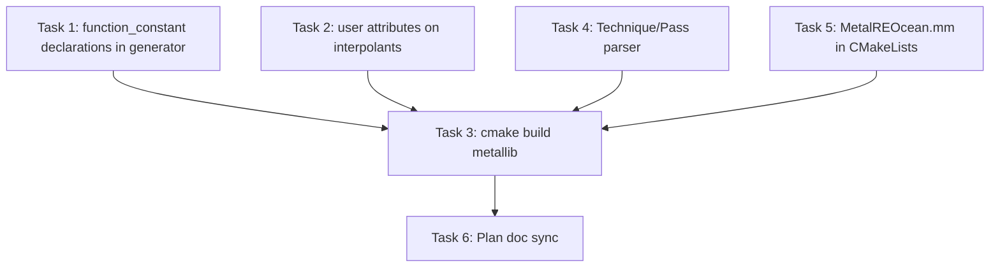

# Metal Renderer — Shader Validation and Plan Sync

## Audit Findings

The following gaps were confirmed by inspecting source files and running counts:

### Gap 1 — `GeneratedShaders.metallib` has never been built (CRITICAL)

995 generated `.metal` files exist in [`RenderDll/XRenderMetal/Generated/`](RenderDll/XRenderMetal/Generated/) but `GeneratedShaders.metallib` is absent from both the source tree and any build directory. The CMake custom command that invokes [`tools/shader_port/lib/build_metal.dart`](tools/shader_port/lib/build_metal.dart) has never been executed. Without the metallib, **every generated shader is unused at runtime**.

### Gap 2 — Generated `.metal` files contain zero `[[function_constant]]` declarations (HIGH)

`grep -r "function_constant" Generated/*.metal` returns 0 matches. [`MetalShaderLoader.mm`](RenderDll/XRenderMetal/MetalShaderLoader.mm) calls `newFunctionWithName:constantValues:error:` with 10 bool constants (fog, HDR, gloss_alpha, etc.), but the shaders declare none. Metal silently ignores the supplied constants — fog blending, HDR branching, and all compile-time specialisation paths are permanently dead code.

The fix belongs in [`tools/shader_port/lib/metal_fragment_builder.dart`](tools/shader_port/lib/metal_fragment_builder.dart): prepend a shared `#include "FunctionConstants.metal"` or emit the declarations inline before the fragment entry.

### Gap 3 — Interpolant structs missing `[[user(name)]]` attributes (HIGH)

Example from [`Generated/HWScripts_Declarations_CGPShaders_CGRCAmbient.crycg.json.metal`](RenderDll/XRenderMetal/Generated/HWScripts_Declarations_CGPShaders_CGRCAmbient.crycg.json.metal):

```metal
struct cgrcambient_input {
  float4 position [[position]];
  float2 Tex0;           // no [[user(Tex0)]] — matched by index, not by name
};
```

Without `[[user(Tex0)]]`, Metal matches by positional index. This is fragile and breaks when the vertex and fragment shaders disagree on ordering (e.g. when a generated fragment shader is paired with a `UtilShaders.metal` vertex that uses named attributes like `[[user(tex0)]]`).

The fix is in `metal_fragment_builder.dart` `_buildInputStruct()`: add `[[user(<name>)]]` to every varying field.

### Gap 4 — `parser.dart` does not parse `Technique { Pass { VertexProgram / FragmentProgram } }` (MEDIUM)

Confirmed: `grep -n "VertexProgram\|Technique" tools/shader_port/lib/parser.dart` returns 0 matches. The `p3-manifest-pairing-crycg` task is genuinely not started. 589 `.crycg` source files exist at the correct path (`Assets/Shaders/Source/Shaders/HWScripts/Declarations/CGPShaders/`). The pairing heuristic in [`tools/shader_port/lib/metal_generator.dart`](tools/shader_port/lib/metal_generator.dart) handles only ~23%.

### Gap 5 — `MetalREOcean.mm` is not in `CMakeLists.txt` sources (LOW)

[`RenderDll/XRenderMetal/MetalREOcean.mm`](RenderDll/XRenderMetal/MetalREOcean.mm) implements `CREOcean::InitVB`, `GetVBPtr`, `mfDraw` etc. but is absent from the `METAL_SOURCES` list in [`RenderDll/XRenderMetal/CMakeLists.txt`](RenderDll/XRenderMetal/CMakeLists.txt). If the game's render-element factory ever creates a `CREOcean` (legacy path), these methods will be unresolved at link time.

### Gap 6 — Plan docs have stale and incorrect content (LOW)

- [`docs/metal_renderer_plan.md`](docs/metal_renderer_plan.md): "Critical Architecture Issues" section (Issues 1–4) still describes problems that have been resolved; shader source path in §3.1 reads `Assets/Shaders/Source/HWScripts/…` but the correct path is `Assets/Shaders/Source/Shaders/HWScripts/…`.
- [`.cursor/plans/metal_renderer_full_plan_ae4efcec.plan.md`](.cursor/plans/metal_renderer_full_plan_ae4efcec.plan.md): `p3-shader-ambient/bump/effects` are `pending` but the real blocker is Gap 1 (metallib not built), not a porting gap.

---

## Tasks

### Task 1 — Emit `[[function_constant]]` declarations from the generator

**File:** [`tools/shader_port/lib/metal_fragment_builder.dart`](tools/shader_port/lib/metal_fragment_builder.dart)

In the `build()` method, before the struct and entry-point output, prepend the 10 function-constant declarations that match the indices in `MetalShaderLoader.mm`:

```metal
constant bool fog_enabled     [[function_constant(0)]];
constant bool hdr_enabled     [[function_constant(1)]];
constant bool gloss_alpha     [[function_constant(2)]];
constant bool env_light       [[function_constant(3)]];
constant bool atten_enabled   [[function_constant(4)]];
constant bool proj_light      [[function_constant(5)]];
constant bool plants_bending  [[function_constant(6)]];
constant bool alpha_glow      [[function_constant(7)]];
constant bool multiple_lights [[function_constant(8)]];
constant bool high_precision  [[function_constant(9)]];
```

These must also be emitted for vertex shaders (`data.stage == 'vertex'`), since vertex functions can also be specialised.

Then re-run the generator: `dart tools/shader_port/lib/metal_generator.dart .` to regenerate all 995 `.metal` files.

---

### Task 2 — Add `[[user(name)]]` attributes to generated interpolant structs

**File:** [`tools/shader_port/lib/metal_fragment_builder.dart`](tools/shader_port/lib/metal_fragment_builder.dart)

In `_buildInputStruct()` (or equivalent), add `[[user(<field_name>)]]` to every non-position interpolant field:

```dart
// Before: 'float2 ${v.name};'
// After:
'  ${v.metalType} ${v.name} [[user(${v.name})]];'
```

The `[[position]]` field is left unchanged. Regenerate after this fix.

---

### Task 3 — Build the metallib (validates gaps 1–3)

After Tasks 1 and 2 have regenerated the `.metal` files:

```bash
cmake -B build -DCMAKE_BUILD_TYPE=Debug
cmake --build build --target GeneratedMetalShaders
```

The CMake command (line 241 of `RenderDll/XRenderMetal/CMakeLists.txt`) will run:

```
dart build_metal.dart <root> Generated/ <air_dir> GeneratedShaders.metallib
```

which calls `xcrun metal -c` per file and links into one metallib. **Expected failures**: generated shaders that reference undeclared globals or use invalid MSL syntax after translation. Each error must be fixed in the generator (not in the generated file) and the generator re-run.

**Success criterion:** `cmake --build build --target GeneratedMetalShaders` exits 0 and `build/RenderDll/XRenderMetal/GeneratedShaders.metallib` exists.

---

### Task 4 — Implement `p3-manifest-pairing-crycg` in `parser.dart`

**File:** [`tools/shader_port/lib/parser.dart`](tools/shader_port/lib/parser.dart)

Add a `parseTechniquePairs(String src)` function that:
1. Finds `Technique <name> { … }` blocks using a regex or character scanner.
2. Inside each `Technique`, finds `Pass <name> { … }` blocks.
3. Inside each `Pass`, extracts `VertexProgram = "<name>";` and `FragmentProgram = "<name>";`.
4. Returns a `Map<String, String>` of `fragmentName → vertexName`.

**File:** [`tools/shader_port/lib/metal_generator.dart`](tools/shader_port/lib/metal_generator.dart)

In the second-pass loop (around line 95, after all entries are generated), replace the `_resolveVertexEntryPoint` stem heuristic with a lookup from `parseTechniquePairs()` first, falling back to the stem heuristic for any unmatched entries. Write `vertexEntryPoint` for each resolved fragment entry in `manifestEntries`.

Add unit test in `tools/shader_port/test/manifest_test.dart`: verify that vertex-pairing coverage improves from 23% to >90%.

---

### Task 5 — Add `MetalREOcean.mm` to CMakeLists sources

**File:** [`RenderDll/XRenderMetal/CMakeLists.txt`](RenderDll/XRenderMetal/CMakeLists.txt)

Add `MetalREOcean.mm` to the `METAL_SOURCES` list (alongside `MetalRenderElements.mm`). The file requires `-x objective-c++` compile flag like the other `.mm` sources in the same list.

---

### Task 6 — Sync plan document statuses

**File:** [`docs/metal_renderer_plan.md`](docs/metal_renderer_plan.md)
- Remove "Critical Architecture Issues" section entirely (Issues 1–4 are resolved).
- Fix shader source path reference: `Assets/Shaders/Source/HWScripts/…` → `Assets/Shaders/Source/Shaders/HWScripts/…`.
- Mark `p3-shader-ambient`, `p3-shader-bump`, `p3-shader-effects` as `❌ Blocked (metallib not built)` until Task 3 succeeds, then update to `🔶 Partial (compiled; visual validation pending)`.

**File:** [`.cursor/plans/metal_renderer_full_plan_ae4efcec.plan.md`](.cursor/plans/metal_renderer_full_plan_ae4efcec.plan.md)
- `p3-manifest-pairing-crycg`: keep `pending` until Task 4 done.
- `p3-shader-ambient/bump/effects`: update content to note that the real blocker is metallib compilation (Task 3), not a porting gap.

---

## Execution Order



Tasks 1, 2, 4, 5 can be done in parallel. Task 3 validates all of them. Task 6 reflects whatever Task 3 reveals.