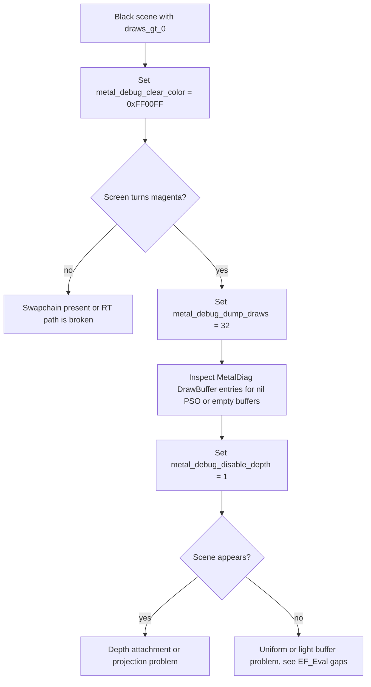

# Metal renderer — render-element status

Snapshot of the per-`EDataType` `mfDraw` coverage in the Metal backend, after
the **fix metal scene draws** pass. Every entry here is either:

- **Implemented** — issues `drawIndexedPrimitives` (directly, or via
  `CMetalBaseRenderer::DrawBuffer` / `DrawDynVB`).
- **Canonical no-op** — silent `return true;` that matches the OGL/D3D9
  semantics (used by passes where the draw is performed elsewhere via
  the chunked `CMetalREOcLeaf` path).
- **Stubbed** — placeholder that does not draw and is **not** ready for
  visual gameplay. Instrumented with `METAL_STUB_TRACE` (gate-2 telemetry,
  see `RenderDll/Common/StubTelemetry.h`) so the log surfaces them at
  runtime when `cry_trace_render_gates 2` is set.

## Implemented render elements

| EDataType                | Class                  | Source                                                  | Notes |
|---|---|---|---|
| `eDATA_OcLeaf`           | `CMetalREOcLeaf`       | `MetalRenderElements.mm`                                | Indexed draw via `DrawBuffer`. Reference template for new ports. |
| `eDATA_TempMesh`         | `CRETempMesh`          | `MetalRETempMesh.mm`                                    | Ported from `XRenderOGL/GLRERender.cpp`. Issues `DrawBuffer` for dynamic streams. |
| `eDATA_ClearStencil`     | `CREClearStencil`      | `MetalREClearStencil.mm` + `CMetalBaseRenderer::ClearStencilBuffer` | Ends current encoder, restarts pass with `stencilLoadAction = MTLLoadActionClear`. |
| `eDATA_Sky`              | `CMetalRESky`          | `MetalRenderElements.mm`                                | Pre-existing native Metal path. |
| `eDATA_Ocean`            | `CMetalREOcean`        | `MetalREOcean.mm`                                       | Pre-existing FFT ocean. |
| `eDATA_OcclusionQuery`   | `CREOcclusionQuery`    | `MetalRenderElements.mm`                                | Constructed via `new CREOcclusionQuery()` in factory; no GPU draw needed. |
| `eDATA_ScreenProcess`    | `CREScreenProcess`     | (common)                                                | Existing fullscreen path. |

## Canonical no-ops (geometry drawn by OcLeaf path)

| EDataType            | Class                  | Why no-op |
|---|---|---|
| `eDATA_TerrainSector`| `CMetalRECommon`       | Terrain sectors are emitted via `CMetalREOcLeaf` chunks; this class only carries metadata. Matches OGL/D3D9 behaviour. |
| `eDATA_TriMesh`      | `CMetalRETriMesh`      | Generic tri-meshes draw through the `CMetalREOcLeaf` chunked path attached to each `SMatInfo`. |
| `eDATA_Prefab`       | `CMetalREPrefabGeom`   | Prefabs delegate to the per-chunk OcLeaf draws; this class is a per-instance marker. |
| `eDATA_OcLeaf` (base)| `CREOcLeaf`            | Base virtual stub; should be unreachable because `CMetalREOcLeaf` overrides it. Instrumented with telemetry so any actual hit is visible. |

A `RendererLogicTests` regression test now guards each of these against
silently re-introducing the broken "set state but no draw" stub.

## Sun flares (depth visibility)

| EDataType         | Class           | Source                       | Notes |
|---|---|---|---|
| `eDATA_FlareGeom` | `CREFlareGeom`  | `MetalREFlareGeom.mm`        | Time-based fade (no synchronous depth readback). Matches NULL renderer behaviour. **Follow-up**: async blit + 1-frame-latency depth probe for true occluded flares. |

## Stubbed (placeholder factories, no draw)

The factory in `CreateMetalRenderElement` returns a bare `new CRendElement()`
that does nothing on `mfDraw`. These will silently no-op until a Metal
port is written. Listed in (approximate) impact order on gameplay visuals:

| EDataType            | What it is                                 | Visible effect of stub |
|---|---|---|
| `eDATA_ShadowMapGen` | Shadow map render-target pass              | No real shadow maps; objects render unshadowed. |
| `eDATA_TriMeshShadow`| Shadow-volume mesh draws                   | No stencil-volume shadows. |
| `eDATA_HDRProcess`   | HDR tonemap / bloom / glare composite      | HDR pipeline already runs through the dedicated `m_hdrToneMapPSO`; this RE is unused on Metal in practice. |
| `eDATA_FlashBang`    | FlashBang grenade fullscreen flash         | Grenade flash effect missing. |
| `eDATA_Glare`        | Lens-glare overlay                         | Lens glare missing (sun coronas still drive `CREFlareGeom`). |
| `eDATA_Flare`        | Legacy flare placeholder                   | Subsumed by `CREFlareGeom`; unused on Metal. |
| `eDATA_Beam`         | Beam render element                        | Missing on Metal; not exercised by stock levels. |
| `eDATA_Dummy`        | Intentional placeholder                    | Intended no-op. |

## Per-pass texture binding contract

CryEngine's scene render pipeline is two-phase: the bucket walker selects a
PSO/shader pair, then **each `SShaderPass` is responsible for binding its own
material textures** before any draw call records vertices. In the OGL and
D3D9 backends this is invoked from `EF_PipeLine` via
`if (slw->mfSetTextures()) ...` (`XRenderOGL/GLRendPipeline.cpp:4490, 4783,
5435, 5641, 6101`). The Metal port's `SShaderPass::mfSetTextures` is fully
implemented and routes through `CMetalTextureManager::ApplyTexUnit` to
`[encoder setFragmentTexture:atIndex:]`, but **the call site was missing
from `CMetalRenderer::EF_EndEf3D`**, so every scene fragment shader sampled
nil — rendered as opaque black on Metal — which produced the
"180 draws/frame but black screen" signature observed in `log.txt`.

**Contract**: the `drawBucket` lambda in `EF_EndEf3D` must call
`pPass->mfSetTextures()` immediately before `ri.Item->mfDraw(pShader, pPass)`,
guarded by `if (pPass)` for shaders without HW techniques. The
`test_ef_endef3d_binds_pass_textures_before_mfdraw` regression test locks
this invariant in source so the binding cannot regress without breaking the
build.

Texture binding flow:

```
EF_EndEf3D bucket loop
  -> pPass->mfSetTextures()
       -> for each m_TUnits[i]: SShaderTexUnit::mfSetTexture(i)
            -> CMetalTextureManager::ApplyTexUnit(stage, *this)
                 -> resolve ITexPic -> id<MTLTexture>
                 -> fallback to m_whiteTexture if missing
                 -> GetOrCreateSamplerState(unit)
                 -> BindTexture(stage, texture)   // setFragmentTexture: stage
                 -> BindSampler(stage, sampler)   // setFragmentSamplerState: stage
  -> ri.Item->mfDraw(pShader, pPass)
       -> SetCullMode/SetState/DrawBuffer (state on m_renderEncoder)
```

Follow-ups (out of scope for the black-scene fix):

- Per-pass uniform evaluation: `EF_Eval_DeformVerts`, `EF_Eval_TexGen`,
  `EF_Eval_RGBAGen` (`XRenderOGL/GLRendPipeline.cpp:5634-5636`) are still
  missing on Metal. Visual fidelity will be lower than D3D9/OGL until those
  evaluations land — surfaces using vertex deformation, animated texgen, or
  per-pass RGBA generators will not animate correctly.
- LMaterial application: `m_LMaterial->mfApply(slw->m_LMFlags)` and
  `EF_ConstantLightMaterial` are not invoked on Metal; per-material light
  constants come from the global material buffer only.

## Pass-restart contract

The Metal `m_renderEncoder` lifetime is **not** stable across the bucket loop
in `CMetalRenderer::EF_EndEf3D`. Several functions reachable from `mfDraw`
end the current encoder and start a fresh render pass:

| Site | Trigger | Restart attachments |
|---|---|---|
| `CMetalBaseRenderer::ClearStencilBuffer` | `CREClearStencil::mfDraw` (`EFSLIST_STENCIL_ID` bucket) | color/depth = `Load`, stencil = `Clear` |
| `CMetalBaseRenderer::ClearColorBuffer`   | `ClearBuffer` calls from the engine    | color = `Clear`, depth/stencil = `Load` |
| `CMetalBaseRenderer::ClearDepthBuffer`   | depth-prepass clears                   | color = `Load`, depth/stencil = `Clear` |
| `CMetalBaseRenderer::BeginHDRPass`       | HDR-enabled frames                     | binds `m_hdrColorRT` (different texture) |
| `CMetalRenderer::PrepareDepthMap`        | shadow map preparation                 | depth-only pass on `m_shadowMapTexture` |
| `CMetalUtilityRenderer::SetRenderTarget` | offscreen RT push/pop                  | RT-specific |

Because the new encoder is a **different `id<MTLRenderCommandEncoder>`** than
the one in use before the restart, any caller that captured a local copy of
`m_renderEncoder` (the bucket loop in `EF_EndEf3D` did this) sees a released
object after the swap. State setters (`setRenderPipelineState`,
`setVertexBuffer`, `setFragmentBuffer`) become silent no-ops while
`DrawBuffer` continues to use `m_renderEncoder` and submits draws with no
PSO/uniforms bound — the original "180 draws per frame but black screen"
signature.

**Contract**: `EF_EndEf3D` refreshes its local `encoder` from
`m_renderEncoder` at the top of every iteration of every `drawBucket` and
resets `prevShader = nullptr` whenever the pointer changes, forcing a PSO
re-bind on the new encoder. A null-encoder `continue` guard protects against
a pass-restart that failed to produce a new encoder. Three regression tests
in `RendererLogicTests.cpp` (`test_ef_endef3d_refreshes_encoder_inside_bucket_loop`,
`test_ef_endef3d_resets_prev_shader_on_encoder_swap`,
`test_ef_endef3d_handles_null_encoder_after_pass_restart`) lock this
behaviour in source.

When `cry_trace_render_gates >= 2`, `ClearStencilBuffer` and the
`EF_EndEf3D` loop each emit a one-shot `[CryTrace]` line so future
regressions of the contract are visible in `log.txt`.

## Bisection cvars for the "draws > 0, screen black" symptom

Three console variables drive the investigation path described in
[`black_3d_scene_investigation_637e93ce.plan.md`](../../.cursor/plans/black_3d_scene_investigation_637e93ce.plan.md).
All are gated, default-off, and read from the same render thread that submits
the frame, so toggling them has no measurable cost in shipping builds.

| CVar | Type | Effect |
|---|---|---|
| `metal_debug_clear_color`   | packed `0xRRGGBB` | Overrides the swapchain colour clear with the supplied RGB and forces `MTLLoadActionClear`. Splits "swapchain never presents" from "swapchain presents but draws emit black". |
| `metal_debug_dump_draws`    | non-negative int  | Logs the first N *real* encoder draw submissions across **every** instrumented path — `DrawBuffer(idx/prim)`, `DrawDynVB(pool/idx)`, `DrawTriStrip`, `FullscreenPass`, `HDRToneMap`, `DebugBatched`, `RESky::SkySphere`, `RESky::FogLayer`, `REOcean::mfDraw`, `REOcean::Sector/ScreenLodSetup/ScreenLodFinal`, `Utility::DrawImage`. Each entry lists `site`, `enc`, `pso`, `prim`, `verts`, `indices`. Decrements per logged call. |
| `metal_debug_disable_depth` | int 0/1           | Forces `SetDepthTest(false)` for every `EF_EndEf3D` scene draw, and emits a one-shot `[MetalDiag] depth-disable engaged` line the first time the path fires so the override is independently observable in the log. |

Because the in-game console is unreachable when the screen is black, the
canonical way to set them is `SystemCfgOverride.Cfg` next to the executable
(`FarCry.app/Contents/MacOS/SystemCfgOverride.Cfg`) — that directory is the
process cwd at launch on macOS, which is what `CSystem::LoadConfiguration`
opens via `fopen`. Example:

```
metal_debug_clear_color = "16711935"  -- 0xFF00FF magenta
metal_debug_dump_draws  = "8"
cry_trace_render_gates  = "2"
```

`CSystem::LoadConfiguration` runs the file once at `SystemInit.cpp:1292`,
which is **before** the renderer registers its cvars in
`CMetalRenderer::Init`. To make renderer-owned cvars from the override
take effect, `RegisterMetalConsoleVariables` re-invokes
`iSystem->LoadConfiguration("SystemCfgOverride.Cfg")` immediately after
registration. It also accepts environment-variable fallbacks
(`METAL_DEBUG_CLEAR_COLOR`, `METAL_DEBUG_DUMP_DRAWS`,
`METAL_DEBUG_DISABLE_DEPTH`, `CRY_TRACE_RENDER_GATES`) so the bisection
can be driven without modifying any file:

```
METAL_DEBUG_CLEAR_COLOR=16711935 \
METAL_DEBUG_DUMP_DRAWS=16 \
CRY_TRACE_RENDER_GATES=2 \
./cmake-build-debug/FarCry.app/Contents/MacOS/FarCry
```

Diagnostic flow:



The dump helper lives in `RenderDll/XRenderMetal/MetalDrawDiag.{h,mm}` and is
invoked immediately before every `[encoder draw*Primitives:]` call in the
renderer. The DrawBuffer-only dump that used to live inline in
`CMetalBaseRenderer::DrawBuffer` is removed — RE-paths such as `CMetalRESky`,
`CMetalREOcean`, and `CMetalRenderer::ExecuteDebugCommands` bypass `DrawBuffer`
and would otherwise drop out of the bisection. A consequence: when the dump
reports zero entries but `EndFrame draws=N (>0)`, the only explanation is that
draws are going through a *non-instrumented* path (only `MetalOptimizations.mm`
indirect command encoder and the test shaders are exempt today), which is itself
a bug worth surfacing.

Source-level tests in `RendererLogicTests.cpp`
(`test_metal_debug_cvars_registered`,
`test_metal_draw_diag_module_present`,
`test_metal_draw_diag_instrumented_at_every_encoder_draw_site`,
`test_metal_draw_diag_call_precedes_encoder_draw`,
`test_metal_debug_clear_color_overrides_pass_descriptor`,
`test_metal_debug_disable_depth_disables_depth_in_EF_EndEf3D`)
lock the wiring against future regressions.

## Per-shader uniform buffer at fragment slot 2

The generated fragment shaders (`RenderDll/XRenderMetal/Generated/*.metal`)
declare their per-shader uniform struct at `[[buffer(2)]]`
(`kMetalPerShaderFragmentUniformSlot`). Slots 0 and 1 are reserved for the
global `Uniforms` and the per-draw `MaterialUniforms`. Until this fix
landed, slot 2 was never bound, so every `uniforms.Diffuse`,
`uniforms.Ambient`, `uniforms.GlobalFogColor` access read zero. The result
was `OUT.Color = decalColor * NdotL * 0 = black` for the entire world,
even though PSOs, textures, depth state, and vertex streams were all
correct. The black-scene investigation log nailed it down to this slot
once the diagnostic firehose showed 481/512 world draws hitting the
`cgrcbump_diff` PSO with the proper encoder.

`RenderDll/XRenderMetal/MetalPerShaderUniforms.{h,mm}` introduces
`MetalPerShaderUniforms::Binder`, a single-responsibility module that:

1. Parses each fragment shader's `uniforms` array out of
   `generated_manifest.json` at startup (offsets computed from the field
   types, struct size aligned to 16 bytes).
2. Owns a Metal ring buffer (`PerShaderUniformsRing`) that is reset every
   `BeginFrame` and grown if a frame ever exceeds its 64 KB starting
   capacity.
3. Looks up the active shader's field list at draw time, packs the
   current values from the engine's `MaterialUniformsData` /
   `UniformBufferData` snapshots into the next 256-byte-aligned slot, and
   binds the buffer at slot 2 of the fragment stage.

The named field → CPU-source mapping is intentionally small and explicit
(`Diffuse`, `Ambient`, `Specular`, `FogColor`/`GlobalFogColor`,
`DiffuseSun`). Unknown fields are zero-filled and emit a one-shot
`[PerShaderUniforms] no supplier for field 'X' — zeroed` log line so the
gap is visible without flooding. Adding suppliers for the long tail of
post-process uniforms is straightforward: register the source pointer in
`Binder::PackField`.

Wiring lives in `CMetalShaderManager::LoadGeneratedShaders`
(`MetalShaderLoader.mm`, registers each shader's field list once) and in
`CMetalRenderer::EF_EndEf3D` (binds the packed slot immediately after
`setRenderPipelineState` and before the draw). Source-level regressions
(`test_metal_per_shader_uniforms_module_present`,
`test_metal_per_shader_uniforms_registered_in_manifest_loader`,
`test_metal_per_shader_uniforms_bound_in_ef_endef3d`,
`test_metal_per_shader_uniforms_reset_each_frame`) keep the four call
sites from drifting.

## Material texture binding (fragment slots 0..N)

The Metal port stubs `CShader::mfCompileHW` to `return nullptr` in
`RenderDll/Common/MacOSStubs.cpp`, which means `pShader->m_HWTechniques`
stays empty for every game material shader. The render-item loop in
`EF_EndEf3D` then computes `pPass = nullptr` and the engine's normal
texture-binding entry point (`pPass->mfSetTextures()`, which would have
populated fragment slots via `SShaderPass::m_TUnits`) is a silent no-op.
That left **fragment texture slots 0..N unbound** for every world draw;
the generated `cgrcbump_diff` fragment sampled nil at `baseMap` and
`bumpMap`, returning zero, which the rest of the math multiplied out to
pure black — even after the per-shader uniform fix above. The
`metal_debug_dump_texunits` cvar made this visible by logging
`pPass=nil` for all 16 instrumented draws.

`RenderDll/XRenderMetal/MetalMaterialTextureBinder.{h,mm}` introduces
`MetalMaterialTextureBinder::Binder`, which sidesteps the dead
`m_HWTechniques` path entirely:

1. Reads each fragment shader's `textures` array out of
   `generated_manifest.json` (e.g. `cgrcbump_diff →
   baseMap@0, bumpMap@1, normCubeMap@2`) at startup and stores it
   keyed by the normalized shader name.
2. Maps each manifest texture name to its `EFTT_*` slot in
   `SRenderShaderResources::m_Textures[]` via a static name table
   (`baseMap → EFTT_DIFFUSE`, `bumpMap → EFTT_BUMP`,
   `glossMap → EFTT_GLOSS`, etc.).
3. At draw time, for each entry in the layout, resolves the
   live `ITexPic` from the current `pRes` and binds the corresponding
   `id<MTLTexture>` and the default `MTLSamplerState` to the
   fragment slot the shader expects.
4. Engine-built-in textures (`normCubeMap`, `attenMap`, `projMap`,
   `shadMap*`, fog/screen/HDR luminance maps, …) have no entry in
   `m_Textures`. They fall back to the 1×1 white texture so geometry
   is visible while we keep porting the built-in suppliers. The
   binder logs a single `[MaterialTextureBinder] no EFTT mapping for
   fragment texture name 'X'` line per unknown non-built-in name so
   regressions are still surfaced.

Wiring lives in `CMetalShaderManager::LoadGeneratedShaders`
(registers each shader once) and in `CMetalRenderer::EF_EndEf3D`
(`GetMaterialTextureBinder().BindForShader(...)` runs immediately after
the PSO and per-shader uniform binds, before `ri.Item->mfDraw`).
Source-level regressions (`test_metal_material_texture_binder_module_present`,
`test_metal_material_texture_binder_registered_in_manifest_loader`,
`test_metal_material_texture_binder_bound_in_ef_endef3d`) lock the wiring.

## Telemetry conventions

- Stub-hit telemetry uses `METAL_STUB_TRACE(tag, fmt, ...)` /
  `METAL_STUB_TRACE_BARE(tag)`. Both emit at most once per first hit and
  every 300 hits thereafter, only when `cry_trace_render_gates >= 2`.
- The Metal `EndFrame` per-second draw-call counter
  (`[CryTrace] EndFrame frame=… draws=…(+…) tris=…(+…)`) is gated at
  `cry_trace_render_gates >= 1`; it remains the primary signal that the
  scene is reaching the GPU.
- A first-hit-only `[BrushLM]` diagnostic in `Cry3DEngine/BrushLM.cpp`
  surfaces the supplied vs required UV counts for the first lightmap that
  hits the mismatch path. This runs unconditionally on macOS to make the
  per-level signature obvious in `log.txt`.

## Follow-ups (out of scope of the black-screen fix)

1. **Async depth readback for `CREFlareGeom`** — replace the time-based
   fade with a 1-frame-latency depth probe (`MTLBlitCommandEncoder`
   copy → `id<MTLBuffer>` → `addCompletedHandler` callback).
2. **Lightmap UV mismatch** — current diagnostic prints the
   `iNumTexCoords` vs `m_SecVertCount` per asset. The mismatch is
   bake-side (`levellm.pak` baked by the editor on a different
   `evs_*` policy than the runtime's `evs_NoSharing` path). A
   follow-up should either:
   - re-bake `levellm.pak` against `evs_NoSharing` semantics, or
   - reconcile by expanding the brush-side UV list at load time using
     the leaf-buffer's vertex remap table.
3. **`eDATA_ShadowMapGen` / `eDATA_TriMeshShadow`** — needed for
   real-time shadows. Port path: separate depth-only render pass with
   `MTLRenderPassDescriptor.depthAttachment.texture = m_shadowMap`.
4. **`eDATA_FlashBang` / `eDATA_Glare`** — fullscreen post effects;
   should follow the existing `CMetalRenderer::PrepareDynVBColortexDrawState`
   pattern used for `Draw2dImage`.
