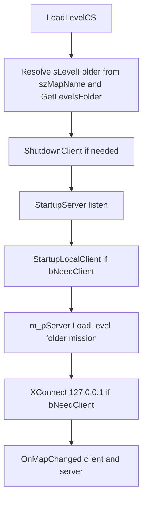

# Single-player and the local server

This note explains why Far Cry (CryEngine-style) single-player still creates a **server** in-process and how [`CXGame::LoadLevelCS`](CryGame/Game.cpp) wires it to a **local client**. Use it when debugging load order, loopback connect, or “why does SP call `StartupServer`?”

## Executive summary

The game simulation is **server-authoritative**: the side identified as the **server** owns the authoritative world state (entities, game rules, much of the gameplay logic). The **client** handles presentation, input, and the local view of that state—the same split as multiplayer.

In **single-player**, both roles run in **one process**: a **`CXServer`** is created first, then (when not dedicated) a **`CXClient`**. The level is loaded on the **server’s** [`ISystem`](CryCommon/ISystem.h) via `LoadLevel`. After that succeeds, the local client **connects to the local server** over **loopback** (`127.0.0.1`) with [`XConnect`](CryGame/XClient.cpp), so SP is structurally “client joined to host,” not a separate client-only engine.

## Why not a client-only single-player path?

- **One implementation for SP and MP**: mission flow, entities, and replication-related assumptions stay aligned; fixes and features apply to both modes.
- **Clear authority**: gameplay decisions stay on the server path; the client remains a consumer of that simulation (mirrors multiplayer mental model).
- **Cost**: extra overhead versus a hypothetical minimal SP-only loop, but the codebase consistently funnels SP through the client–server shape.

## Terminology

| Term | Meaning in this codebase |
|------|---------------------------|
| **Local server / listen context** | [`StartupServer(listen)`](CryGame/GameClientServer.cpp) constructs [`CXServer`](CryGame/XServer.h) in-process. The `listen` argument is forwarded into server construction and relates to whether the session is set up to accept external clients (see `LoadLevelCS` parameter `listen`). |
| **Dedicated** | [`GetSystem()->IsDedicated()`](CryGame/Game.cpp) is true when there is no local player client; `LoadLevelCS` sets `bNeedClient` false so [`StartupLocalClient`](CryGame/GameClientServer.cpp) is skipped and there is no `XConnect` for a local player. |
| **Local client** | [`StartupLocalClient`](CryGame/GameClientServer.cpp) builds [`CXClient`](CryGame/XClient.h) with `Init(this, true)`. The in-source comment calls this a **“fake connection”** path versus a remote multiplayer client. |

## Sequence (reference: `LoadLevelCS`)

Order matches [`CXGame::LoadLevelCS`](CryGame/Game.cpp) (approximately lines 1531–1660):

1. **Resolve level directory** — `sLevelFolder` starts as `szMapName`. If it contains no `\` or `/`, it is treated as a bare map name and becomes `GetLevelsFolder() + "/" + sLevelFolder` (default folder string is `"Levels"` in [`GetLevelsFolder`](CryGame/GameMods.cpp)).
2. **Optional UI** — non-multiplayer paths configure the loading console image and progress bar.
3. **Tear down old client** — if `m_pClient` exists and `keepclient` is false, [`ShutdownClient`](CryGame/GameClientServer.cpp) runs.
4. **Start server** — if there is no server or `keepclient` is false, [`StartupServer(listen)`](CryGame/GameClientServer.cpp) creates `CXServer` (retrying another port on failure).
5. **Start local client** — when `bNeedClient` is true (`!IsDedicated()` and client (re)creation is required), [`StartupLocalClient`](CryGame/GameClientServer.cpp) runs **before** the level load (comment in code: local client must exist before load).
6. **Load level on the server** — [`m_pServer->m_pISystem->LoadLevel(sLevelFolder.c_str(), szMission, false)`](CryGame/Game.cpp) drives pak open, XML, 3D engine, entities, etc. (see [`LoadLevelCommon`](CryGame/XSystemBase.cpp)).
7. **Connect client to server** — if `bNeedClient` and `m_pClient`, [`XConnect("127.0.0.1")`](CryGame/Game.cpp) (with a multiplayer variant that passes extra flags for non-LAN server type).
8. **Notify map change** — [`OnMapChanged`](CryGame/XClient.cpp) / server-side counterpart as applicable.



`StartupLocalClient`, loopback `XConnect`, and client `OnMapChanged` are skipped when `bNeedClient` is false (for example a **dedicated** run where `IsDedicated()` is true).

## Code map

| Location | Symbol | Role |
|----------|--------|------|
| [CryGame/Game.cpp](CryGame/Game.cpp) | `CXGame::LoadLevelCS` | Orchestrates SP/MP load: path resolution, server/client lifecycle, `LoadLevel`, loopback `XConnect`. |
| [CryGame/GameClientServer.cpp](CryGame/GameClientServer.cpp) | `CXGame::StartupServer` | Allocates `CXServer`, binds port (`sv_port`), registers RCon if present. |
| [CryGame/GameClientServer.cpp](CryGame/GameClientServer.cpp) | `CXGame::StartupLocalClient` | Creates local `CXClient` with `Init(this, true)` (“fake connection”). |
| [CryGame/GameClientServer.cpp](CryGame/GameClientServer.cpp) | `CXGame::ShutdownClient` | Disconnects and destroys the client before a new load when not keeping the client. |
| [CryGame/GameMods.cpp](CryGame/GameMods.cpp) | `CXGame::GetLevelsFolder` | Returns the base levels directory string (default `"Levels"`). |
| [CryGame/XSystemBase.cpp](CryGame/XSystemBase.cpp) | `CXSystemBase::LoadLevelCommon` | Shared work for client/server `LoadLevel`: paks, `LevelData.xml`, engine and entity load. |

## Related pitfalls

**Loading image path vs. disk path** — The loading-screen texture is built from **`szMapName`**, not from `sLevelFolder`:

```1579:1581:CryGame/Game.cpp
		string sLoadingScreenTexture = string("levels/") + string(szMapName) + string("/loadscreen_") + string(szMapName) + ".dds";

		m_pSystem->GetIConsole()->SetLoadingImage(sLoadingScreenTexture.c_str());
```

So a symlinked or renamed `Levels` tree still loads via `sLevelFolder`, but the **console loading image** may not match if `szMapName` and the on-disk layout diverge (case, prefix, or relative roots).

**Logging** — `ILog::Log` applies verbosity prefixes and can write both to the console and to `Log.txt` subject to `log_Verbosity` / `log_FileVerbosity` (see [`CryCommon/ILog.h`](CryCommon/ILog.h) and [`CrySystem/Log.cpp`](CrySystem/Log.cpp) `CheckAgainstVerbosity`). `LogToConsole` is console-oriented; default validator handling still forwards warnings and errors through `ILog::Log` with `\001`/`\002` prefixes. When correlating with `Log.txt`, confirm the log file path (`Log.txt` default) and the process working directory.
