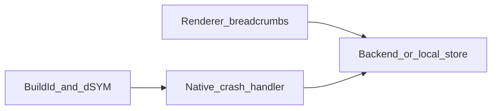

# macOS crash reporting and Metal-port observability — roadmap

This document is a **cross-cutting** path from “local logs and lldb” to **local, attributable** crash capture, symbolicated stacks, and renderer-aware triage. It complements the Metal renderer production roadmap ([`metal_renderer_production_roadmap.md`](metal_renderer_production_roadmap.md)): that doc covers shader packaging, pairing, visuals, and automation goals; **this** doc covers **how failures are captured, attributed to a build, and diagnosed on a developer machine** on macOS with Metal. **Scope:** local development only until a CI or hosted crash pipeline exists—no mandatory CI symbol upload or centralized build archive.

---

## How this relates to other docs

| Document | Role |
|----------|------|
| [`metal_renderer_production_roadmap.md`](metal_renderer_production_roadmap.md) | Phases A–H: assets, shaders, techniques, QA, automation, performance |
| [`metal_renderer_plan.md`](metal_renderer_plan.md) | Renderer feature/status matrix (unchanged) |
| [`metal-shader-load-fatal-resolution.md`](metal-shader-load-fatal-resolution.md) | `ShaderLoadFatal` policy, tiers, LLDB batch workflow |
| [`.cursor/rules/verify-fixes-at-runtime.mdc`](../.cursor/rules/verify-fixes-at-runtime.mdc) | Runtime smoke expectations after fixes |

---

## Charter

### Goals

- **Attributable crashes:** every native crash ties to a **unique build identity** (version, git SHA, CMake profile) and **symbolicated** stacks for the game binary and `XRenderMetal` (or equivalent renderer module).
- **Metal-aware context:** failures involving shaders, PSO creation, or GPU work are triaged with **last-known renderer state** (not only a CPU backtrace).
- **Regression signal:** distinguish **new** crash signatures between local builds *N* and *N−1* (saved reports, logs, or a dashboard if you add one later).
- **Minimal sensitive data:** no account credentials, no free-form user paths where avoidable; explicit retention stance.

### Non-goals

- Full **APM** (distributed traces, per-frame profiling in production).
- **Player analytics** (sessions, funnels) unless explicitly merged later under separate policy.
- **Non-macOS** platforms in this roadmap (document may be reused as a template).

### Early decisions (record when chosen)

| Decision | Options | Notes |
|----------|---------|--------|
| Backend | SaaS (e.g. Sentry, Backtrace) vs **self-hosted** minidump/symbol pipeline | SaaS faster; self-hosted for strict air-gap or custom retention |
| Audience | **Local dev / internal ad-hoc builds** vs eventual ship builds | Ship builds imply consent and off-device transport review; symbol handling stays on the workstation for now (manual `atos`/`lldb`, optional SaaS upload later) |
| Breadth | **CPU crash only** first vs CPU + **non-fatal** Metal error stream | Non-fatals can ship to file/log first, then backend |

---

## Integration hook inventory (codebase anchors)

Use these as the default seams for crash init, breadcrumbs, and GPU error logging. Paths are relative to the repo root.

| Area | File | What to attach or extend |
|------|------|---------------------------|
| Process entry, `CreateSystemInterface` | [`FARCRY/Main.cpp`](FARCRY/Main.cpp) (`main`, ~936–1027 under `__APPLE__`) | Earliest consistent place to install macOS crash handler **after** minimal static init; before heavy game work. |
| Legacy Windows crash UI | [`CrySystem/DebugCallStack.cpp`](CrySystem/DebugCallStack.cpp) | Win32-oriented; **do not** port behavior 1:1 — add an **Apple-specific** path for minidump/signal handling. |
| Command buffer lifecycle | [`RenderDll/XRenderMetal/MetalBaseRenderer.mm`](RenderDll/XRenderMetal/MetalBaseRenderer.mm) | `TrackCommandBuffer` (~285–322): `addCompletedHandler` — extend to read `completedBuffer.error` / status after commit; `BeginFrame` (~893–951): frame id, drawable acquisition, DEBUG startup shader checks. |
| Shader fatal path | [`RenderDll/XRenderMetal/MetalShaderManager.mm`](RenderDll/XRenderMetal/MetalShaderManager.mm) | `ShaderLoadFatal` / `ShaderLoadFatalItem` (~87+), `EF_LoadShader` failure sites — last requested name, class, flags for breadcrumb ring. |
| Generated shader load | [`RenderDll/XRenderMetal/MetalShaderLoader.mm`](RenderDll/XRenderMetal/MetalShaderLoader.mm) | `LoadGeneratedShaders`, `ValidateShaderPairs` (see production roadmap Phase E) — manifest/metallib resolution path for “what was loaded.” |
| System error path (reference) | [`CrySystem/SystemWin32.cpp`](CrySystem/SystemWin32.cpp) `CSystem::Error` | On macOS, analogous “last chance” logging may already go through `ILog`; crash reporter should still capture **pre-terminate** native faults. |

---

## Phased roadmap

### Phase 0 — Build identity and symbols (foundation)

**Goal:** No local crash report is orphaned from its binary.

| Work | Evidence / mechanism | Exit criteria |
|------|----------------------|---------------|
| Single **build id** string | Inject at compile time (e.g. CMake `add_compile_definitions` for `GIT_SHA`, build date, Debug/Release) or read from plist/bundle | Every log line or crash attachment can print the same id |
| **dSYM** for app + renderer dylibs | Xcode/CMake: `DEBUG_INFORMATION_FORMAT`, strip settings documented per configuration; keep the dSYM next to the built app on disk | A test crash from a **local** Debug (or RelWithDebInfo) build symbolicates to file:line on the same machine via `atos` or `lldb` for the main binary and Metal renderer |
| Artifact association | Same **staging** story as [`metal_renderer_production_roadmap.md`](metal_renderer_production_roadmap.md) Phase A for `GeneratedShaders.metallib` + `generated_manifest.json` | Build id logged at startup includes or references shader bundle identity when relevant |

---

### Phase 1 — Native macOS crash capture

**Goal:** Unhandled faults become **on-disk** (or optional SaaS) reports with stacks; symbolication uses **local** dSYM from Phase 0.

| Work | Evidence / mechanism | Exit criteria |
|------|----------------------|---------------|
| Choose handler technology | Out-of-process model (e.g. **Crashpad**) or Apple-centric workflow documented | Decision recorded in charter table |
| Install at safe point | After [`FARCRY/Main.cpp`](FARCRY/Main.cpp) early init, before `CreateGame`; avoid recursive crash in handler | Forced test crash writes a report locally (or to chosen backend) with metadata; stacks symbolicated with the **local** dSYM from the same build |
| Optional SaaS later | If you add Sentry/Backtrace/etc., symbol upload can be scripted **from the dev machine** or added when CI exists | Not a requirement for the local-dev milestone |

---

### Phase 2 — Metal-specific runtime context

**Goal:** GPU/command-buffer and shader failures are diagnosable without guessing.

| Work | Evidence / mechanism | Exit criteria |
|------|----------------------|---------------|
| Command buffer errors | In `addCompletedHandler` paths ([`MetalBaseRenderer.mm`](RenderDll/XRenderMetal/MetalBaseRenderer.mm) `TrackCommandBuffer`, `BeginFrame` completion block ~918–920), read error when `status != completed` | Log or non-fatal event includes domain/code and frame id |
| Encoder / PSO labels | `setLabel:` on encoders, pipelines, key buffers (incremental) | GPU capture and logs show human-readable pass/shader names |
| Shader load breadcrumbs | On `ShaderLoadFatal` path and successful `LoadGeneratedShaders` milestones — ring buffer of last N **names + lookup keys** | Artificial shader miss produces a report listing the failing key per [`metal-shader-load-fatal-resolution.md`](metal-shader-load-fatal-resolution.md) |
| DEBUG parity | Align with integration smoke in [`.cursor/rules/run-tests-before-commit.mdc`](../.cursor/rules/run-tests-before-commit.mdc) (`BeginFrame`, `ValidateShaderPairs`) | No contradiction between documented smoke and breadcrumb fields |

---

### Phase 3 — Workflow and triage

**Goal:** The team can prioritize and regress-test fixes.

| Work | Evidence / mechanism | Exit criteria |
|------|----------------------|---------------|
| Compare builds locally | Log excerpts, saved crash reports, or optional lightweight diff keyed by build id | You can tell whether a regression appeared between two local builds (dashboard optional) |
| Runbooks | Link LLDB batch scripts from [`metal-shader-load-fatal-resolution.md`](metal-shader-load-fatal-resolution.md) and [`.cursor/rules/lldb-batch-debug-scripts.mdc`](../.cursor/rules/lldb-batch-debug-scripts.mdc) | One index page lists “crash receipt → symbol check → shader doc → repro smoke” |

---

## Architecture (reference)

---

## Risk register

| Risk | Impact | Mitigation |
|------|--------|------------|
| PII in breadcrumbs (paths, machine user name) | Compliance / trust | Strip paths; use hashes; internal-only first |
| Disk clutter from dSYM bundles | Hard to find matching symbols | One folder per build or symlink; document where Xcode/CMake leaves `.dSYM` for this target |
| Sandbox / entitlements (App Store or hardened runtime) | Crash reporter cannot write or upload | Validate entitlements early; optional user-in-the-loop export |
| Handler re-entrancy / deadlock | Lost crashes or secondary faults | Minimal work in signal path; out-of-process reporter |
| Breadcrumb volume | Performance / log spam | Fixed-size ring; rate-limit identical events |

---

## Reference index

| Topic | Location |
|-------|----------|
| `ShaderLoadFatal` | [`RenderDll/XRenderMetal/MetalShaderManager.mm`](../RenderDll/XRenderMetal/MetalShaderManager.mm) |
| Generated shader load | [`RenderDll/XRenderMetal/MetalShaderLoader.mm`](../RenderDll/XRenderMetal/MetalShaderLoader.mm) |
| Frame / command buffer | [`RenderDll/XRenderMetal/MetalBaseRenderer.mm`](../RenderDll/XRenderMetal/MetalBaseRenderer.mm) |
| macOS `main` | [`FARCRY/Main.cpp`](../FARCRY/Main.cpp) |
| Production roadmap (Phase F and automation) | [`metal_renderer_production_roadmap.md`](metal_renderer_production_roadmap.md) |

---

*This roadmap defines delivery phases for observability; implementation follows after charter decisions and prioritization.*
