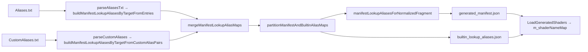

# Metal shader-load fatal resolution

> Strict policy, decision tree, and resolution log for `MetalShaderManager.mm`
> `ShaderLoadFatal` aborts. Companion to [`shader-aliases.md`](shader-aliases.md)
> (alias-table format) and [`metal_renderer_plan.md`](metal_renderer_plan.md)
> (port status).

---

## 1. The runtime gate

```
Assertion failed: (!"MetalShaderManager: required shader missing
  (manifest / Aliases.txt / lookupAliases)"),
  function ShaderLoadFatal, file MetalShaderManager.mm, line 96
```

`ShaderLoadFatal` is a **hard abort**. It fires when:

1. `EF_LoadShader` is called with a `flags & EF_SYSTEM` bit set, and
2. The requested name resolves to neither a manifest fragment nor a
   `lookupAliases` entry in `RenderDll/XRenderMetal/Generated/generated_manifest.json`.

The strict policy is to **keep this gate strict**. We never soften it, never
convert it to a diagnostic accumulator, and never silently fall back to a
generic shader (`basic`, `colortex`, `cgrcambienttempl`, …). Every miss is a
real engineering signal that needs precise classification.

```cpp
// RenderDll/XRenderMetal/MetalShaderManager.mm
static void ShaderLoadFatal(const char* op, const char* requestedName,
                            const char* lookupKey, EShClass Class, int flags)
{
    // … log diagnostics …
    assert(!"MetalShaderManager: required shader missing "
            "(manifest / Aliases.txt / lookupAliases)");
    std::abort();
}
```

### History

| Commit    | Effect                                                                                       |
| --------- | -------------------------------------------------------------------------------------------- |
| `d31e143` | Removed legacy `~200` in-memory aliases, stripped last-resort fallback chain, introduced `ShaderLoadFatal`. |
|           | The replacement (manifest-driven aliases + caller-side soft-load) was incomplete.            |

The strict abort itself is **correct**. The failures it surfaces are
historical caller bugs: code that asks for shaders the Metal port doesn't
ship and uses `EF_SYSTEM` even when the use site already null-checks.

---

## 2. The four tiers of shader resolution

A name handed to `EF_LoadShader` can resolve through any of these tiers. The
Metal port wires **tiers 1–3** into runtime lookup through **manifest fragments**
and **`lookupAliases`** (tiers 2–3 are emitted by `metal_generator.dart`).
**Tier 4** remains unported and that gap still shapes resolution for legacy
high-level shader objects.

| Tier | Source                                              | Format                                                  | Metal port state                                                                                  |
| ---- | --------------------------------------------------- | ------------------------------------------------------- | ------------------------------------------------------------------------------------------------- |
| 1    | **Manifest fragments**                              | `RenderDll/XRenderMetal/Generated/generated_manifest.json` (`normalized` keys) | ✅ Wired — primary lookup path                                                                    |
| 2    | **Flat aliases** (`Aliases.txt`)                    | `Assets/Shaders/Source/Shaders/Aliases.txt`            | 🔶 Wired through Dart → manifest `lookupAliases` and/or `builtin_lookup_aliases.json` (builtins)   |
| 3    | **Conditional aliases** (`CustomAliases.txt`)       | `Assets/Shaders/Source/Shaders/CustomAliases.txt`      | 🔶 Wired through Dart — merged with Tier 2, then split across manifest `lookupAliases` and builtins |
| 4    | **Top-level `Shader 'X' ( … )` blocks** in `.csl`   | `Assets/Shaders/Source/Shaders/HWScripts/Techniques/*.csl`, `Scripts/CryShaders/*.csl` | ❌ Not ported — Metal port has only fragment-level `CGRC*`/`CGVProg*` programs                    |

### Build-time architecture — tiers 2–3 → `lookupAliases`

Manifest fragments use **`lookupAliases`** on each row. Builtin stand-ins (`terrain`, `basic`, …) use a companion JSON: nothing in `CustomAliases.txt` is evaluated as true/false at codegen; the Dart pipeline produces a **static** union, then splits it for registration during `LoadGeneratedShaders`.

**Data flow**



**Target folding (Tier 2 and Tier 3 right-hand sides)** — `resolveCustomAliasesTargetForManifest` in [`tools/shader_port/lib/alias_auditor.dart`](../tools/shader_port/lib/alias_auditor.dart):

1. Repeatedly apply **`kIntermediateAliases`** (e.g. `lowspecwateroutdoor_fp` → `cgrclowmedwater`, `lowspecwaterindoor_fp` → `cgrcindoorwater`; other entries still route legacy FP names to **`terrain`** where that remains the stand-in).
2. Apply **`resolveAliasesTxtTarget`**, which reads **`kAliasesTxtTargetToManifestNormalized`** and optional entries from [`tools/shader_port/config/alias_target_to_manifest.json`](../tools/shader_port/config/alias_target_to_manifest.json) (merged at generator startup).

**Builtin alias registration** — If the resolved target is in **`kMetalBuiltins`**, aliases are written under that builtin’s key in **`builtin_lookup_aliases.json`**. At the start of `CMetalShaderManager::LoadGeneratedShaders`, the loader reads that file (next to `generated_manifest.json`) and registers each alias string to the same shader id as the primary builtin name (e.g. terrain pass names → `terrain`).

**Merge semantics** — `mergeManifestLookupAliasMaps(A, B)` starts from the `Aliases.txt` map `A`, then appends each alias from `B` per manifest target key **without duplicate strings** on the same target.

**Audit parity** — `auditAliases` resolves each pair’s target with the same **`resolveCustomAliasesTargetForManifest`** result before checking **`kMetalBuiltins`** or the manifest name set (see [`tools/shader_port/test/audit_aliases_test.dart`](../tools/shader_port/test/audit_aliases_test.dart)).

**Explicit non-goals for this architecture**

- No legacy **`RegisterShaderAlias`** path for the merged alias tables (avoid double-mapping). Builtin companion JSON is still a single registration path into `m_shaderNameMap`.
- No D3D-style **CVar/GPU condition evaluation** at codegen; policy is **first alias occurrence wins** globally (see Tier 3 below). Full parity with `CShader::mfShaderNameForAlias` conditional blocks remains future work (profiles or runtime evaluation).

### Tier 1 — Manifest fragments

- Generated by `tools/shader_port/lib/metal_generator.dart`.
- Each entry corresponds to one Metal shader: `cgrcterrain`, `cgrcflare`,
  `cgrcdefault`, `cgrc_hdr_finalscene_ps20`, etc.
- This is the only tier that actually serves draw calls.
- **Vertex rows:** logical names that map to **vertex** programs (for example
  `decal_vp` → `cgvprogdecal`) are registered when
  `LoadGeneratedShaders` runs a **vertex registration pass** after caching VS
  metadata and pairing each standalone VS manifest row with a representative
  fragment row for PSO creation. See
  [`metal_vertex_manifest_registration.md`](metal_vertex_manifest_registration.md).

### Tier 2 — `Aliases.txt`

- Format and semantics described in [`shader-aliases.md`](shader-aliases.md).
- The Dart pipeline (`alias_auditor.dart`) parses entries; targets use **`resolveCustomAliasesTargetForManifest`** (same folding as `CustomAliases.txt`). The generator (`metal_generator.dart`) attaches non-builtin aliases as **`lookupAliases`** on manifest rows and emits builtin-bound aliases into **`builtin_lookup_aliases.json`**.
- **`findUnmatchedAliasTargets`** warns only when a resolved target is **neither** a manifest `normalized` key **nor** a **`kMetalBuiltins`** entry handled by the builtin JSON — no silent drops.

### Tier 3 — `CustomAliases.txt` (shipping reference)

**Metal policy:** the Dart pipeline parses **every** `{ … }` block in the source file and applies **first occurrence wins** per alias name (same as `parseCustomAliases` dedup). **GPU/CVar conditions are not evaluated** at manifest generation time; static precedence is defined only by file order and first-seen alias rows.

Right-hand targets such as `LowSpecWaterOutdoor_FP` / `LowSpecWaterIndoor_FP` are chained through `alias_auditor.dart` intermediate maps and `resolveAliasesTxtTarget` (plus optional `alias_target_to_manifest.json`) so they fold onto manifest `normalized` keys or builtins (for example `cgrclowmedwater`, `cgrcindoorwater`, `terrain`) before emission into each fragment’s `lookupAliases` or `builtin_lookup_aliases.json`. The merged map is combined with **Tier 2** (`Aliases.txt`) via `mergeManifestLookupAliasMaps` — duplicate alias strings under the same target are skipped.

The **shipped** `FCData/Shaders/CustomAliases.txt` (extracted from
`Shaders.pak` / Steam install) contains exactly **4 conditional blocks**:

| Block condition              | What it covers                                                                          |
| ---------------------------- | --------------------------------------------------------------------------------------- |
| `r_OffsetBump = 0`           | `TemplBumpSpec_*Offset_PS20 → TemplBumpSpec_*_PS20` (turn off offset-bump permutation)  |
| `GPU = NV1X`                 | Massive GF2-tier remap of `TemplBumpSpec_*` → `TemplDiffuse_FP`, water/terrain to `_FP` |
| `r_Quality_BumpMapping = 1/2/3` | Bump-quality cascade: `TemplBumpDiffuse_SpecHigh → TemplBumpSpec[_PS20]`             |
| `r_NoPS20 = 1`               | PS2.0 disabled cascade: PS20 variants → non-PS20 variants                               |
| `r_Vegetation_PerpixelLight = 1` | `TemplPlantsBark → TemplPlantsBark_Bump`                                            |

**Critical finding:** none of the system-shader names that abort during
startup appear anywhere in the shipping `CustomAliases.txt` or `Aliases.txt`.
That includes `CryLight`, `Default`, `ScreenTexMap`, `ScreenProcess`,
`OutSpace`, `FarTreeSprites`, `ClearStencil`, `ShadowMapGen`,
`BinocularDistortMask`, `ScreenDistort`, `<Stencil>`, `RainMap`,
`SniperDistortMask`, `TerrainWaterBeach`, `TerrainLowLOD`,
`TerrainDetailLayers`, `TerrainLightPass`, `TerrainShadowPass`,
`TerrainWithFog`, `TerrainLayer`, `TerrainDetailTextureLayers`,
`TerrainWithDefaultDetailTexture`, `ParticleLight`.

### Tier 4 — Top-level `Shader 'X' ( … )` blocks

Many "system shader" names the engine asks for are **not** fragment programs.
They are **high-level CryEngine 1 shader objects** declared inline in `.csl`
files within the shipping `Shaders.pak`:

| Name                       | Source `.csl` (in `Shaders.pak`)                              | Notes                                              |
| -------------------------- | ------------------------------------------------------------- | -------------------------------------------------- |
| `CryLight`                 | `Shaders/Scripts/CryShaders/Lights.csl:1016`                  | Sun-corona client effect, references `SunFlare01`  |
| `Terrain`                  | `Shaders/HWScripts/Techniques/terrain.csl:7`                  | Main terrain technique (Metal port: `cgrcterrain`) |
| `TerrainWaterBeach`        | `Shaders/HWScripts/Techniques/terrainWater.csl:3113`          | Beach/shore water shader                           |
| `ParticleLight`            | `Shaders/HWScripts/Techniques/Templates.csl:583`              | Particle light template                            |
| `FogLayer`                 | `Shaders/HWScripts/Techniques/Templates.csl:1510`             | Fog volume layer                                   |
| `ScreenTexMap`             | `Shaders/HWScripts/Techniques/FixedPipeline.csl:1019`         | **Fixed-function** screen blit (no programmable fragment) |
| `ScreenProcess`            | `Shaders/HWScripts/Techniques/FixedPipeline.csl:973`          | **Fixed-function** glare blit                      |
| `ShadowMapGen`             | `Shaders/HWScripts/Techniques/FixedPipeline.csl:49`           | Shadow-map depth generator                         |
| `BinocularDistortMask`     | `Shaders/HWScripts/Techniques/BumpOffset.csl:14`              | Binocular zoom mask                                |
| `ScreenDistort`            | `Shaders/HWScripts/Techniques/BumpOffset.csl:122`             | Screen-space distortion                            |

These cannot be loaded by the Metal port without authoring proper IRs
(`.crycg.json`) and porting their pass logic. **Many of them are
fixed-function** — they have no programmable fragment at all in CryEngine 1.

### Names that don't exist in the shipping game

The following names the engine asks for via `EF_SYSTEM` are **not defined
anywhere** in the shipping `Shaders.pak`:

```
Default       OutSpace       FarTreeSprites    ClearStencil
<Stencil>     RainMap        SniperDistortMask InfRedGal
```

In the original Far Cry these were resolved by hardcoded C++ fallbacks
(silently mapped to a generic shader) inside the original `RenderDll`. Those
C++ fallbacks were intentionally removed in commit `d31e143`. Per the
strict policy, restoring those fallbacks is **forbidden**: they masked the
fact that the Metal port has no implementation for them. The correct
resolution for these is **caller-bug** (see §5).

---

## 3. Decision tree for a new abort

When `lldb` halts on `ShaderLoadFatal`, follow this tree precisely. Do not
short-circuit to a fallback.

```
                        ShaderLoadFatal(name="X")
                                  │
                                  ▼
         ┌───────────────────────────────────────────────────┐
         │ Q1. Is X a logical synonym for a manifest         │
         │      fragment Y that already implements the same  │
         │      logical shader? (e.g. CryLight ≡ CGRCFlare)  │
         └────────────┬─────────────────────────┬────────────┘
                      │ yes                     │ no
                      ▼                         ▼
       ┌────────────────────────┐   ┌──────────────────────────────────┐
       │ A. TRUE-ALIAS          │   │ Q2. Does X have a real           │
       │ ─────────────────────  │   │      shader/IR somewhere we      │
       │ • Append `X Y` to      │   │      should port?                │
       │   Assets/Shaders/      │   │      (legacy CG, .crycg.json)    │
       │   Source/Shaders/      │   └────────┬─────────────────────┬───┘
       │   Aliases.txt          │            │ yes                 │ no
       │ • Re-run               │            ▼                     ▼
       │   validate_migration   │ ┌──────────────────────┐   ┌───────────────────┐
       │ • Add C++ test         │ │ B. MISSING SHADER    │   │ Q3. Does the      │
       │   (RendererLogicTests) │ │ ──────────────────── │   │      caller code  │
       │ • Add Dart test        │ │ • Author             │   │      already null │
       │   (audit_aliases_test) │ │   .crycg.json IR     │   │      check the    │
       └────────────────────────┘ │ • Hook into pipeline │   │      result?      │
                                  │ • Regen manifest     │   └────┬───────────┬──┘
                                  │ • Add tests          │        │ yes       │ no
                                  └──────────────────────┘        ▼           ▼
                                                  ┌───────────────────┐ ┌───────────────┐
                                                  │ D. CALLER BUG     │ │ E. NEW HARD   │
                                                  │ ───────────────── │ │    REQUIREMENT│
                                                  │ Drop EF_SYSTEM at │ │ ───────────── │
                                                  │ the call site (or │ │ Author the    │
                                                  │ remove the call). │ │ shader. Don't │
                                                  │ Add static-text   │ │ ship without  │
                                                  │ regression test.  │ │ it.           │
                                                  └───────────────────┘ └───────────────┘
```

Forbidden moves:

- Mapping `X` to a generic fragment that isn't logically equivalent
  (`basic`, `cgrcambienttempl`, `colortex`, `terrain`, …).
- Softening `ShaderLoadFatal` so misses are warnings.
- Adding a fake/empty manifest entry just to silence the abort.
- Leaving an alias entry undocumented (every alias has a one-line
  justification + one C++/Dart test).

---

## 4. Diagnostic workflow (`lldb --batch`)

A reusable LLDB script lives at `build/shader_abort_session.lldb`:

```
target create FarCry.app/Contents/MacOS/FarCry
breakpoint set -n ShaderLoadFatal
breakpoint set -n ShaderLoadFatalItem
run
frame select 0
frame variable
bt 30
quit
```

Run it from the build directory:

```bash
cd /Users/<you>/projects/FarCry/build
lldb --batch -s shader_abort_session.lldb > shader_abort_<tag>.txt 2>&1
```

The captured frame variables tell you:

| Variable        | Meaning                                                           |
| --------------- | ----------------------------------------------------------------- |
| `requestedName` | Name as passed to `EF_LoadShader`                                 |
| `lookupKey`     | Normalized lookup string used inside the manager                  |
| `Class`         | `EShClass` (`eSH_World`, `eSH_Misc`, …)                           |
| `flags`         | Flag mask. `0x20000000` = `EF_SYSTEM`                             |
| Backtrace       | The exact engine call site (file:line)                            |

`bt 30` is the most important data point — it identifies which engine
subsystem is asking for the shader, and you classify against the tree in §3.

---

## 5. The caller-bug class

Most aborts during startup are not "missing shaders" but **caller bugs**:
engine code passes `EF_SYSTEM` even though every use site of the resulting
pointer null-checks. The function name often signals this directly
(`LoadRendererShaderSafe`).

### Pattern

```cpp
// BUG — name says "Safe" but flag forces fatal
IShader* shader =
    pRenderer->EF_LoadShader(name, eSH_World, EF_SYSTEM);
if (shader)            //   ← every call site does this
    return shader;
return nullptr;        //   ← unreachable when EF_SYSTEM aborts first
```

### Fix

```cpp
// CORRECT — soft load; null is acceptable; ShaderLoadFatal
//           remains strict for legitimate EF_SYSTEM callers.
IShader* shader =
    pRenderer->EF_LoadShader(name, eSH_World, 0);
return shader;         // may be null; caller already null-checks
```

### Verification checklist before applying the fix

For every call site whose `EF_SYSTEM` we drop:

1. Grep every read of the resulting pointer/member.
2. Confirm at least one of the following at each use:
   - explicit `if (m_pShX) { … }` or equivalent guard;
   - the consumer (renderer queue / `SetChunk` / `EF_AddEf`) tolerates
     a null shader internally;
   - the call is followed by a render path that itself null-checks.
3. If any use crashes on null, this is **not** a caller bug — escalate to
   true-alias (path A) or missing-shader (path B).
4. Add a static-text regression test (see §7).

### Caller-bug fixes landed (startup path)

| Module / function                               | File                                | Calls fixed |
| ----------------------------------------------- | ----------------------------------- | ----------- |
| `LoadRendererShaderSafe`                        | `Cry3DEngine/3dEngine.cpp:63`       | 1 line; unblocks 16 call sites at lines 184–257 (`CryLight`, `Default`, `ScreenTexMap`, `ScreenProcess`, `OutSpace`, `FarTreeSprites`, `ClearStencil`, `ShadowMapGen`, `BinocularDistortMask`, `ScreenDistort`, `SniperDistortMask`, `RainMap`, `<Stencil>`, `StencilState`, `StencilStateInv`, `TerrainParticles`) |
| `CTerrain::CTerrain()`                          | `Cry3DEngine/terrain_load.cpp:36–38` | 3 lines (`TerrainWaterBeach`, `TerrainLowLOD`, `TerrainDetailLayers`) |
| `CTerrain::LoadTerrain()`                       | `Cry3DEngine/terrain_load.cpp:183–194` | 6 lines (`TerrainLightPass`, `TerrainShadowPass`, `TerrainWithDefaultDetailTexture`, `TerrainWithFog`, `TerrainLayer`, `TerrainDetailTextureLayers`). **Kept `EF_SYSTEM`** on `Terrain` (line 180) — it is genuinely system-required and the manifest provides `cgrcterrain`. |
| `CPartManager::CPartManager()`                  | `Cry3DEngine/partman.cpp:167`       | 1 line (`ParticleLight`) |

Post-fix runtime state: `lldb --batch` runs through `C3DEngine` ctor →
`C3DEngine::Init()` → `CreateGame` → `Starting game` → macOS event loop
with **zero `ShaderLoadFatal` aborts**.

### Caller-bug callers still in the engine (not yet hit at runtime)

These remain `EF_SYSTEM` and will surface only when the corresponding
subsystem actually loads. Classify each on demand using §3.

| Module                                           | Names                                                                                |
| ------------------------------------------------ | ------------------------------------------------------------------------------------ |
| `Cry3DEngine/terrain_water_quad.cpp`             | `TerrainWaterBottomSimple`, `TerrainWater_FP`, `terrainwater`, `BumpSunGlow` (alias landed §6), `OcclusionTest` |
| `Cry3DEngine/DecalManager.cpp`                   | `ParticleLight`, `Decal_VP`, `Decal_2D_VP`                                            |
| `Cry3DEngine/3dEngineLoad.cpp`                   | `FogLayer` (×2 via XML), level-XML shore/water/sun/lensflare loaders                  |
| `Cry3DEngine/3DEngineLight.cpp`                  | `StencilState_Terrain`, `GlowingMonkeyEyes`, dynamic XML light shaders                |
| `Cry3DEngine/3dEngine.cpp:1111`                  | `m_pSHFullScreenQuad` (engine-supplied name)                                          |
| `Cry3DEngine/StatObjRend.cpp`                    | `NoZTestState`, `ZTestGreaterState`                                                   |
| `Cry3DEngine/WaterVolumes.cpp`                   | XML-supplied shader names                                                             |
| `CryAnimation/RenderUtils.cpp`                   | `FrontCull`                                                                           |
| `CryAnimation/CryModelState.cpp`                 | `FrontCull`, `StencilState_FrontCull`                                                 |
| `CryAnimation/CryCharFxTrail.cpp`                | `TemplDecalAdd`                                                                       |
| `CryAnimation/CryCharReShadowVolume.cpp`         | `<Stencil>`                                                                           |
| `CryAnimation/CryCharDecalManager.cpp`           | `DecalCharacter`                                                                      |
| `RenderDll/Common/LeafBufferRender.cpp`          | `NoZTestState`, `ZTestGreaterState`, `ObjectColor_VP`                                 |
| `CrySystem/ScriptObjectSystem.cpp`               | Script-supplied names                                                                 |
| `Editor/ModelViewport.cpp`, `RenderDll/XRenderD3D9/D3DShadows.cpp` | Not built on macOS — ignore                                          |

---

## 6. True-alias resolutions landed

| Engine name        | Manifest fragment | Justification                                                                               |
| ------------------ | ----------------- | ------------------------------------------------------------------------------------------- |
| `crylight`         | `cgrcflare`       | Both are sun lens-flare effect entry points; `m_pSHLensFlares` is consumed via `EF_AddEf` on the flare render-element pipeline. |
| `flare_from_light` | `cgrcflare`       | Pre-existing alias retained from earlier work.                                              |
| `default`          | `cgrcdefault`     | `CGRCDefault` is the Metal port's authored "default decal" component used by `BrushLM::SetChunk` when material binding is absent. |
| `bumpsunglow`      | `cgrcbumpsunglow` | `terrain_water_quad.cpp` and level XML `Environment/Shaders/SunWaterRefl` default call `EF_LoadShader("BumpSunGlow", …, EF_SYSTEM)`; logical name normalizes to `bumpsunglow`, manifest key is `cgrcbumpsunglow`. |

To add a new alias:

1. Edit `Assets/Shaders/Source/Shaders/Aliases.txt`. Format: `Alias Target`,
   one pair per line, whitespace separated.
2. Re-run the unified validator:
   ```bash
   dart tools/shader_port/bin/validate_migration.dart .
   ```
   This runs generate → compile-check → validate-pairs in sequence.
3. Verify the new entry lands in
   `RenderDll/XRenderMetal/Generated/generated_manifest.json` under the
   target fragment's `lookupAliases` array.
4. Add a Dart regression test in
   `tools/shader_port/test/audit_aliases_test.dart`.
5. Add a C++ regression test in
   `RenderDll/XRenderMetal/test/RendererLogicTests.cpp` using `hasLookupAlias`.

---

## 7. Regression-test patterns

All fixes are anchored by tests that fail if a future commit reintroduces the
bug. Pure logic / static-text tests; no Metal API or game runtime needed.

### Static-text contract assertion (caller-bug fixes)

`RendererLogicTests.cpp` walks up from `__FILE__` (and from `getcwd`) to
locate the project root, opens the engine source file, extracts the function
body by brace-balancing, and asserts the body does or does not contain
specific tokens.

```cpp
// Soft-load functions must never pass EF_SYSTEM
const std::string body = findFunctionBody(
    src, "LoadRendererShaderSafe(const char* shaderName)");
CHECK(body.find("EF_SYSTEM") == std::string::npos);
CHECK(body.find("EF_LoadShader") != std::string::npos);

// Truly system-required calls must keep EF_SYSTEM
auto loadShaderHasSystemFlag = [&](const std::string& name) -> bool {
    const std::string needle = "\"" + name + "\"";
    size_t p = lt.find(needle);
    if (p == std::string::npos) return false;
    const size_t lineEnd = lt.find('\n', p);
    return lt.substr(p, lineEnd - p).find("EF_SYSTEM") != std::string::npos;
};
CHECK(loadShaderHasSystemFlag("Terrain"));               // required
CHECK(!loadShaderHasSystemFlag("TerrainLightPass"));     // soft load
```

### Manifest `lookupAliases` assertion (true-alias fixes)

```cpp
auto hasLookupAlias = [&manifest](const std::string& frag,
                                  const std::string& alias) -> bool {
    // walks the manifest text; finds the fragment block whose
    // "normalized" matches frag, then scans its lookupAliases array
    // for "alias".
};
CHECK(hasLookupAlias("cgrcflare", "crylight"));
CHECK(hasLookupAlias("cgrcdefault", "default"));
```

### Build / run

```bash
cd RenderDll/XRenderMetal/test
clang++ -std=c++17 -o renderer_logic_tests RendererLogicTests.cpp
./renderer_logic_tests          # 429/429 expected at the time of writing
```

```bash
cd tools/shader_port
dart test                       # 418/418 expected at the time of writing
```

Both must run before every commit per
`.cursor/rules/run-tests-before-commit.mdc`.

---

## 8. Key invariants

1. `ShaderLoadFatal` and `ShaderLoadFatalItem` stay strict — `assert + std::abort`.
2. `EF_SYSTEM` means **the engine truly cannot run without this shader**.
   It is **not** a "log a warning and continue" flag.
3. A name that resolves through a `lookupAliases` entry has a documented,
   tested justification. Aliases without justification are rejected.
4. Every Aliases.txt entry whose target does not match a manifest
   `normalized` key is reported via `findUnmatchedAliasTargets`. No silent drops.
5. Every caller-bug fix has a static-text regression test that verifies
   the function body no longer contains `EF_SYSTEM`.
6. The shipping `CustomAliases.txt` and `Aliases.txt` are the **canonical
   reference** for legacy alias semantics. Compare against them before
   inventing new aliases.

---

## 9. Reference paths

| Purpose                                      | Path                                                                                  |
| -------------------------------------------- | ------------------------------------------------------------------------------------- |
| Strict abort                                 | `RenderDll/XRenderMetal/MetalShaderManager.mm` — `ShaderLoadFatal`, `ShaderLoadFatalItem` |
| Manifest                                     | `RenderDll/XRenderMetal/Generated/generated_manifest.json`                            |
| Soft-load function (caller fix landed)       | `Cry3DEngine/3dEngine.cpp` — `LoadRendererShaderSafe`                                  |
| Terrain loader (caller fix landed)           | `Cry3DEngine/terrain_load.cpp` — `CTerrain::CTerrain`, `CTerrain::LoadTerrain`         |
| Particle manager (caller fix landed)         | `Cry3DEngine/partman.cpp` — `CPartManager::CPartManager`                               |
| Aliases input (workspace)                    | `Assets/Shaders/Source/Shaders/Aliases.txt`                                            |
| Aliases input (shipping reference)           | Steam install: `FCData/Shaders/Aliases.txt`                                            |
| Conditional aliases (shipping reference)     | Steam install: `FCData/Shaders/CustomAliases.txt`                                      |
| Top-level `Shader 'X'` blocks (shipping)     | Inside `Shaders.pak`: `Shaders/HWScripts/Techniques/*.csl`, `Shaders/Scripts/CryShaders/*.csl` |
| Dart alias auditor                           | `tools/shader_port/lib/alias_auditor.dart`                                             |
| Dart manifest generator                      | `tools/shader_port/lib/metal_generator.dart` (`findUnmatchedAliasTargets`)             |
| Unified validator                            | `tools/shader_port/bin/validate_migration.dart`                                        |
| LLDB session script                          | `build/shader_abort_session.lldb`                                                      |
| C++ regression tests                         | `RenderDll/XRenderMetal/test/RendererLogicTests.cpp`                                   |
| Dart regression tests                        | `tools/shader_port/test/audit_aliases_test.dart`, `test/metal_generator_test.dart`     |
| Workspace rule — runtime verification        | `.cursor/rules/verify-fixes-at-runtime.mdc`                                            |
| Workspace rule — pre-commit testing          | `.cursor/rules/run-tests-before-commit.mdc`                                            |
| Workspace rule — LLDB batch debugging        | `.cursor/rules/lldb-batch-debug-scripts.mdc`                                           |

---

## 10. When to revisit this doc

Every time you classify and fix a new abort:

1. Update §5 (caller-bug list) or §6 (alias list) with the new entry.
2. Move the affected module out of the "still in the engine" table.
3. Add the regression test reference in §7 if a new pattern emerged.
4. If a brand-new resolution path is needed (e.g. tier 4 shader IR
   authored), document the procedure in a new section.
