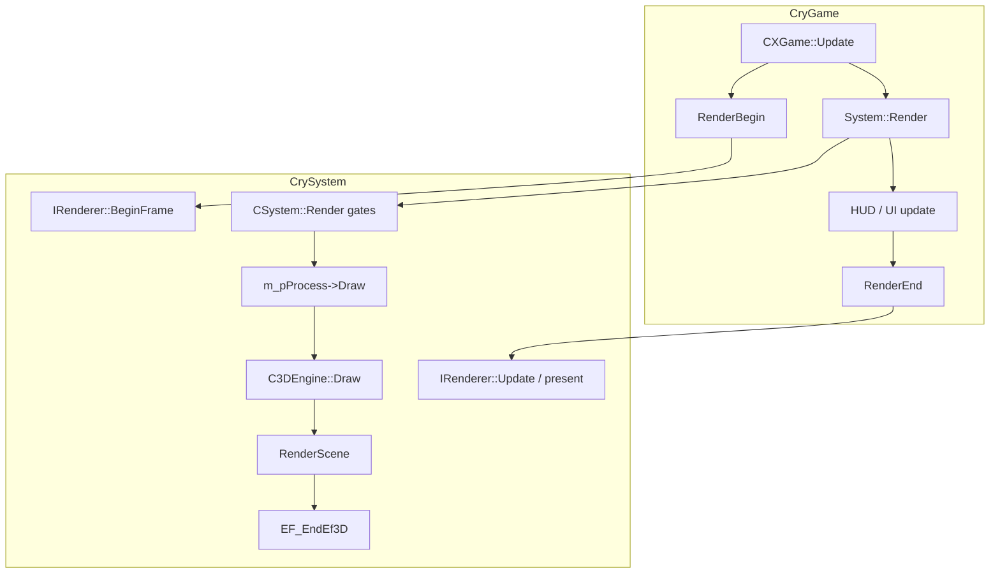

# Metal: pitfalls when the level stays invisible (after shader aliases fix)

Companion to the investigation plan **“Metal 3D visual pitfalls”**. Use this when **`EF_LoadShader` / `lookupAliases` are clean** (no `unregistered`), **`drawBucket` traces show `ok`**, and **`EF_EndEf3D` shows non-zero `ri_gen`**, but the window still looks black or wrong — start with **§3 engine-side gates** to rule out skipped `C3DEngine::Draw` / `RenderScene` before blaming Metal composite.

**Related:** [`metal-shader-load-fatal-resolution.md`](metal-shader-load-fatal-resolution.md) (shader name resolution), [`metal_font_ui_encoder_insights.md`](metal_font_ui_encoder_insights.md) (2D/UI encoder), [`metal_renderer_plan.md`](metal_renderer_plan.md) (port status).

---

## 1. Product decision — `CREScreenProcess` on Metal (scope)

**Status:** **Intentional stub** in the Metal port.

- **Implementation:** [`RenderDll/XRenderMetal/MetalCREScreenProcess.mm`](../RenderDll/XRenderMetal/MetalCREScreenProcess.mm) — `mfPrepare` is empty; `mfDraw` / `mfDrawLowSpec` return `false` (no draws). State is still driven via `mfActivate` / `mfSetParameter` / `CScreenVars` for future or alternate paths.
- **Reference (full behavior):** [`RenderDll/XRenderD3D9/D3DScreenRender.cpp`](../RenderDll/XRenderD3D9/D3DScreenRender.cpp) — screen RT, `m_Text_ScreenMap`, blur/color transfer, etc.
- **Implication:** Any pipeline that **relies on `eDATA_ScreenProcess` issuing `mfDraw` geometry** to composite the final image **does not run** on Metal the same way as D3D9. Loading the `ScreenProcess` **shader** via `lookupAliases` fixes **null `IShader*`** in `Cry3DEngine`; it does **not** restore D3D9’s full-screen render pass.
- **Mitigation options (engineering backlog):**
  1. **Minimal parity:** Port a **subset** of `D3DScreenRender` (single full-screen triangle, one blit from scene/HDR target to drawable) behind CVars.
  2. **Centralize composite:** Ensure **HDR `EndHDRPass` / LDR swapchain pass** in [`CMetalRenderer::EF_EndEf3D`](../RenderDll/XRenderMetal/MetalRenderer.mm) always writes visible pixels to the drawable **without** depending on `CREScreenProcess::mfDraw`.

---

## 2. Log grep checklist (automated / quick)

Run against the game log (e.g. `cmake-build-debug/FarCry.app/Contents/MacOS/log.txt` or the repo symlink):

```bash
rg -n "no active render encoder|EF_EndEf3D — no active|tone-map PSO not ready|HDR requested but|BeginFrame: Failed to acquire drawable|missing Metal PSO|per-shader detail suppressed|missing-PSO summary" log.txt
rg -n "EndHDRPass: no drawable texture|CREScreenProcess::mfDraw \\(Metal stub\\)|r_MetalRenderDiag|Metal HDR:|r_HDRRendering|HDR pipeline init failed" log.txt
rg -n "CSystem::Render: skipped m_pProcess->Draw|C3DEngine::Draw skipped|RenderScene: m_pTerrain is NULL|RenderScene: early return" log.txt
rg -n "Camera undefined" log.txt
rg -n "\\[EngineGate\\]" log.txt
```

**Last captured baseline (repo session):** No matches for encoder / missing-PSO / drawable-failure strings; log contained `Metal HDR: r_HDRRendering=0 (use 0 for LDR / HDR-off comparison)` — **LDR path** for that run. Re-run after changing CVars or builds.

### Black screen but HUD / compass still visible

[`CryGame/Game.cpp`](../CryGame/Game.cpp) calls `RenderBegin()` → `m_pSystem->Render()` (world / `C3DEngine::Draw`) **before** the HUD update path (`m_pCurrentUI->Update()`). So **2D HUD can look fine while the world pass drew nothing or wrote a different attachment than the one presented**. Use §3 engine gates + §4 GPU capture to split “no scene submission” vs “wrong framebuffer / composite.”

### Runtime diagnostics (`r_MetalRenderDiag` + always-on warnings)

**CVar:** `r_MetalRenderDiag` (int, default `0`, `VF_DUMPTODISK`) — registered with the other `r_` CVars in [`Renderer.cpp`](../RenderDll/Common/Renderer.cpp).

| Value | Behavior |
|-------|----------|
| `0` | Default: **throttled** Release-safe messages only (e.g. first **8** unique missing-PSO shader lines, then a single “detail suppressed” line; `EndHDRPass` drawable-nil **once** per session; `CREScreenProcess::mfDraw` stub first hit + every **300** hits). |
| `1` | Adds **HDR begin/end** one-liners for frames **≤ 5**, and extra **encoder-nil** drawable size context on early frames (see [`MetalBaseRenderer.mm`](../RenderDll/XRenderMetal/MetalBaseRenderer.mm), [`MetalRenderer.mm`](../RenderDll/XRenderMetal/MetalRenderer.mm)). |
| `2` | Adds a **periodic** (every **300** frames) **`EF_EndEf3D` missing-PSO summary** when skips occurred (`total_skips` / `events_without_detail_line`). |

**Representative log strings (grep-friendly):**

- `Warning: EF_EndEf3D missing Metal PSO (shader=… vfmt=…)` — first occurrences for up to **8** unique shader names.
- `Warning: EF_EndEf3D missing Metal PSO: per-shader detail suppressed after first 8 unique names`
- `Warning: EF_EndEf3D — no active render encoder (frame=… recurse=… hdrRequested=… useHDR=… nFlags=0x…)`
- `[Metal] EF_EndEf3D encoder nil (startup):` — frames **≤ 2** only.
- `EndHDRPass: no drawable texture while HDR colour RT exists — tone-map skipped`
- `CREScreenProcess::mfDraw (Metal stub): eDATA_ScreenProcess draw requested but no Metal draws are issued`
- `[Metal] EF_EndEf3D missing-PSO summary:` — when `r_MetalRenderDiag >= 2` and `total_skips > 0`.

---

## 3. Engine-side gates (before Metal)

Use **`cry_trace_render_gates 1`** for the `[CryTrace]` lines below. These run **before** any Metal PSO/HDR logic.

### Pipeline (where evidence attaches)



### Gate A — `CSystem::Render` skips `m_pProcess->Draw`

**Code:** [`CrySystem/SystemRender.cpp`](../CrySystem/SystemRender.cpp) — for `PROC_3DENGINE`, if **`m_ViewCamera` is at origin**, world `Draw()` is not called.

**Logs:** **`[EngineGate] CSystem::Render: skipped m_pProcess->Draw (PROC_3DENGINE, view camera at origin)`** — first hit + every **300** frames while the condition holds (always written to `log.txt`). With **`cry_trace_render_gates 1`**, also `[CryTrace] CSystem::Render: skipped…` every **120** frames.

**Also:** [`CrySystem/System.cpp`](../CrySystem/System.cpp) — the same origin check can skip **`m_pProcess->Update()`** during `System::Update`. Log: **`[EngineGate] CSystem::Update: skipped m_pProcess->Update …`** (same throttle).

### Gate B — `C3DEngine::Draw` returns early

**Code:** [`Cry3DEngine/3DEngineRender.cpp`](../Cry3DEngine/3DEngineRender.cpp)

- **`I3DEngine::Enable(0)`** (menu/UI gating from [`CXGame::Update`](../CryGame/Game.cpp)) → **`[EngineGate] C3DEngine::Draw skipped: I3DEngine::Enable(0)…`** (first + every **300** frames) and optional `[CryTrace] …` every **120** frames when **`cry_trace_render_gates`** is on.
- **`IsCameraAnd3DEngineInvalid`** → `Warning(…): … Camera undefined …` plus **`[EngineGate] … caller=… camera or view limits invalid`** (first + every **120** frames) in [`Cry3DEngine/3DEngine.cpp`](../Cry3DEngine/3DEngine.cpp). Null **ObjManager / DecalManager** → one-time **`[EngineGate] IsCameraAnd3DEngineInvalid: ObjManager or DecalManager NULL…`**.

### Gate C — `RenderScene` returns before `EF_StartEf` / `EF_EndEf3D`

**Code:** [`Cry3DEngine/3DEngineRender.cpp`](../Cry3DEngine/3DEngineRender.cpp)

- **`m_pTerrain == NULL`** → **`[EngineGate] RenderScene: m_pTerrain is NULL…`** (first + every **300** frames) and optional `[CryTrace] …` when **`cry_trace_render_gates`** is on.
- **Render stack level ∉ [0,1]** → **`[EngineGate] RenderScene: early return — render stack level …`** (first + every **300** frames) and optional `[CryTrace] …` every **120** frames when **`cry_trace_render_gates`** is on.

If Gate C fires, you should **not** see a healthy main-path `EF_EndEf3D` / `drawBucket` trace for the world.

### Gate D — Metal (drawable, encoder, HDR, composite)

Covered in §1–§2, §4 GPU capture, and §5 HDR. Extra anchor: [`CMetalBaseRenderer::BeginFrame`](../RenderDll/XRenderMetal/MetalBaseRenderer.mm) — `BeginFrame: Failed to acquire drawable resources` drops the frame’s command buffer.

### Contradictory log evidence

| Observation | Likely interpretation |
|-------------|------------------------|
| **`ri_gen` = 0**, no `drawBucket` | Gates **A–C**, or `BeginFrame` drawable failure |
| **`ri_gen` > 0**, black framebuffer | Gate **D** (wrong RT, clear-only, missing composite / present) |
| **HUD visible, world black** | Expected ordering in [`Game.cpp`](../CryGame/Game.cpp); not proof the drawable got scene color |

### Loading UI: double progress bar / menu flash

Often **two progress phases**, not necessarily two full loads: [`CXGame::LoadLevelCS`](../CryGame/Game.cpp) shows the loading console and a huge-range progress bar; [`CXSystemBase::LoadLevelCommon`](../CryGame/XSystemBase.cpp) resets to a real range and ticks the bar to completion. Correlate with `[GameCheckpoint]` lines (`LoadLevelCS begin`, `before_IXSystem_LoadLevel`, `LoadLevelCommon complete`).

---

## 4. GPU Frame Capture procedure (manual, in-level)

Automation cannot replace Xcode here; use this checklist once per bug.

1. **Build DEBUG**, run from Xcode or attach to `FarCry.app`, load a level, reproduce black/wrong frame.
2. **Product → Debug → GPU Frame Capture** (or Metal debugger) — capture **one frame** while `menuOv=0` and the camera is in-world (not menu skip).
3. **Verify in capture:**
   - **Draw count:** Non-zero render commands in the main pass (not only clears).
   - **Color attachments:** World draws target **HDR RT** vs **drawable** vs off-screen; follow **resolve / tone-map** pass if present.
   - **HDR:** If `r_HDRRendering=1`, confirm a pass reads **`m_hdrColorRT`** (float) and writes **swapchain** or drawable-sized texture before present.
   - **Final pass:** Last color write before present should match **`CAMetalLayer` drawable** texture.
4. **Compare:** Capture again with **`r_HDRRendering=0`** (see §5) and diff attachment flow.

Code anchors:

- `EF_EndEf3D` — [`MetalRenderer.mm`](../RenderDll/XRenderMetal/MetalRenderer.mm) (`BeginHDRPass` / `EndHDRPass`, `drawBucket`, encoder guard).
- **Present** — [`MetalBaseRenderer::EndFrame`](../RenderDll/XRenderMetal/MetalBaseRenderer.mm) (`presentDrawable`, commit).

---

## 5. A/B — `r_HDRRendering` (LDR vs HDR)

**CVar:** `r_HDRRendering` — logged at init as `Metal HDR: r_HDRRendering=…` in [`CMetalRenderer` init path](../RenderDll/XRenderMetal/MetalRenderer.mm).

| Value | Intent |
|-------|--------|
| `0` | **LDR** — scene path should render without float HDR intermediate (comparison baseline). |
| `1` | **HDR** — uses `m_hdrColorRT` when `SHDF_ALLOWHDR` and tone-map PSO are ready; **`EndHDRPass`** must run or the drawable may stay wrong. |

**Procedure:**

1. Set `r_HDRRendering=0`, restart, capture log line + GPU frame (§4).
2. Set `r_HDRRendering=1`, restart, repeat.
3. If **only HDR=1** is black, focus on **`InitHDRPipeline`**, **`m_hdrToneMapPSO`**, and **`EndHDRPass`** (see warning `HDR requested but tone-map PSO not ready` in code).

---

## 6. Pitfall summary (code-level)

| ID | Symptom idea | Code / doc anchor |
|----|----------------|-------------------|
| A | Composite / screen FX missing | `CREScreenProcess::mfDraw` no-op — §1 |
| B | Buckets queued, nothing drawn | `m_renderEncoder == nil` → early return + warning in `EF_EndEf3D` |
| C | `ri_gen` > 0, still blank (Release) | Missing PSO → throttled `Warning: EF_EndEf3D missing Metal PSO` + `continue`; DEBUG assert |
| D | HDR on, black swapchain | `BeginHDRPass` / `EndHDRPass` / tone-map attachment mismatch; `EndHDRPass: no drawable texture…` if drawable missing |
| E | Sporadic blank | `AcquireDrawableResources` failure; drawable pool / `nextDrawable` misuse |
| F | “No 3D” at menu / origin camera | `CSystem::Render: skipped m_pProcess->Draw (PROC_3DENGINE, view camera at origin)`; or `menuOv=1` / UI blocking — see §3 Gate A |
| G | UI wrong / clipped | [`metal_font_ui_encoder_insights.md`](metal_font_ui_encoder_insights.md) |
| H | Silent in Release | Many `[MetalDiag]` lines are `#if DEBUG`; use **`r_MetalRenderDiag`** for extra Release lines (see §2 Runtime diagnostics) |
| I | World never reaches `EF_EndEf3D` | §3 Gates A–C: origin skip, `C3DEngine::Enable(0)`, `RenderScene` terrain null or bad render-stack level |
| J | `ri_gen` > 0 / `drawBucket ok` but black | §3 contradiction table — composite / wrong attachment / present; §1 `CREScreenProcess`; §5 HDR; §4 GPU capture |

---

## 7. Integration smoke (project rule)

After renderer changes, the checklist in [`.cursor/rules/run-tests-before-commit.mdc`](../.cursor/rules/run-tests-before-commit.mdc) still applies: DEBUG build, main menu, load level, **`assert(fallbacks == 0)`** in `CMetalRenderer::BeginFrame`, `ValidateShaderPairs`, visual sanity.
