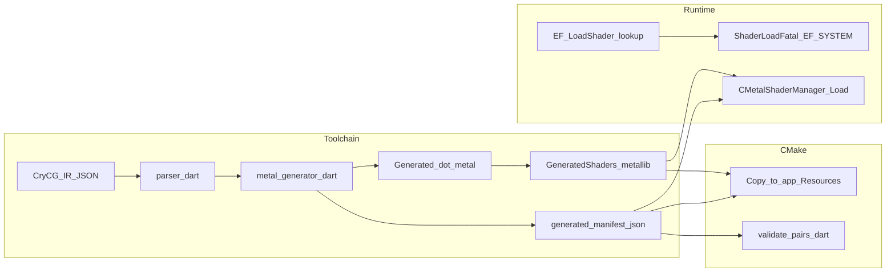

# Metal renderer — production roadmap

This document is a **closure-oriented** path from “macOS build runs” to **shippable confidence** (correct assets, shader resolution, visuals, and automation). It complements the feature status grid in [`metal_renderer_plan.md`](metal_renderer_plan.md): the plan tracks *what exists*; this roadmap tracks *what remains to prove and harden*.

---

## How this relates to other docs

| Document | Role |
|----------|------|
| [`metal_renderer_plan.md`](metal_renderer_plan.md) | P1–P6 checklist with status and notes |
| [`macos_crash_observability_roadmap.md`](macos_crash_observability_roadmap.md) | macOS crash capture, **local** dSYM/symbolication, Metal breadcrumbs, triage workflow (complements Phase F–G; local dev scope) |
| [`metal-shader-load-fatal-resolution.md`](metal-shader-load-fatal-resolution.md) | `ShaderLoadFatal` policy, resolution tiers, decision tree, LLDB workflow |
| [`shader-aliases.md`](shader-aliases.md) | Original CryEngine alias semantics vs Metal port (tiers 1–4) |
| [`metal_pso_validate.md`](metal_pso_validate.md) | Offline **`metal_pso_validate`** binary: manifest-driven PSO creation with vertex descriptor + function constants + pipeline parity |
| [`metal_3d_visual_pitfalls.md`](metal_3d_visual_pitfalls.md) | Black / invisible level **after** shader `lookupAliases` work: GPU capture, `r_HDRRendering` A/B, `CREScreenProcess` stub vs D3D9 |

---

## End-to-end shader pipeline (current)

**Evidence**

- Generation: `GenerateMetalShaderSources` runs parser + `metal_generator.dart`; output under [`RenderDll/XRenderMetal/Generated/`](../RenderDll/XRenderMetal/Generated/). See [`RenderDll/XRenderMetal/CMakeLists.txt`](../RenderDll/XRenderMetal/CMakeLists.txt) (custom command around `GENERATED_STAMP`).
- Build-time pairing: target `ValidateShaderPairs` runs [`tools/shader_port/bin/validate_pairs.dart`](../tools/shader_port/bin/validate_pairs.dart) on `generated_manifest.json` (same CMake file, `ValidateShaderPairs` target).
- Bundling: `GeneratedShaders.metallib` and `generated_manifest.json` are copied to `FarCry.app/Contents/Resources` via `GeneratedMetalBundleResources`; `install()` also places them under `lib` (same CMake file, `install(FILES ...)` and `copy_if_different` commands).
- Runtime load order for generated shaders: main bundle resource → directory next to executable (`MacOS`) → development path `RenderDll/XRenderMetal/Generated/` — [`MetalShaderLoader.mm`](../RenderDll/XRenderMetal/MetalShaderLoader.mm) (`LoadGeneratedShaders`). Inside `LoadGeneratedShaders`, manifest processing uses a vertex-cache pass, a **vertex registration pass** (so `lookupAliases` on vertex-stage manifest rows populate `m_shaderNameMap`), then the fragment pipeline pass — see [`metal_vertex_manifest_registration.md`](metal_vertex_manifest_registration.md). Default util library: similar chain for `UtilShaders.metallib` (`InitializeDefaultShaderLibrary`).

---

## Phase A — Asset and packaging correctness

**Goal:** Every supported launch layout finds the same logical shader payload (metallibs + manifest), with no silent skew.

| Work | Evidence / mechanism | Exit criteria |
|------|----------------------|---------------|
| Confirm `.app` vs `cmake --install` vs running from build tree | Loader resolution in [`MetalShaderLoader.mm`](../RenderDll/XRenderMetal/MetalShaderLoader.mm); staging in [`RenderDll/XRenderMetal/CMakeLists.txt`](../RenderDll/XRenderMetal/CMakeLists.txt) | Documented matrix: which paths apply to each launch mode; smoke test each mode |
| Metallib ↔ manifest version skew | Manifest consumed from same staging step as `GeneratedShaders.metallib` in CMake | Release checklist: single build id or timestamp on both artifacts; failed load logs name + path |
| Optional HLSL conversion path | When `DXC_EXECUTABLE` and `METAL_SHADER_CONVERTER_EXECUTABLE` are set, CMake uses converter metallib branch; else IR→Metal via `build_metal.dart` | Document which branch CI/release uses; both paths produce loadable `GeneratedShaders.metallib` |

---

## Phase B — Shader resolution completeness

**Goal:** No unexpected `ShaderLoadFatal` during real gameplay; every `EF_SYSTEM` request is either a true system shader in the manifest, a documented `lookupAliases` entry, or a fixed caller contract.

| Work | Evidence / mechanism | Exit criteria |
|------|----------------------|---------------|
| Work through remaining high-risk call sites | Table “caller-bug callers still in the engine” in [`metal-shader-load-fatal-resolution.md`](metal-shader-load-fatal-resolution.md) §5 | Each row classified (true-alias / missing shader / caller-bug) per decision tree §3 |
| Expand `lookupAliases` only with justification | Generator folds flat [`Assets/Shaders/Source/Shaders/Aliases.txt`](../Assets/Shaders/Source/Shaders/Aliases.txt) into manifest via [`tools/shader_port/lib/metal_generator.dart`](../tools/shader_port/lib/metal_generator.dart) (`parseAliasesTxt`, `manifestLookupAliasesForNormalizedFragment`) | New aliases: Dart + C++ regression tests per fatal-resolution §6–§7 |
| Track `EF_SYSTEM` on macOS-built sources | Uses remain in e.g. `Cry3DEngine`, `CryAnimation`, `LeafBufferRender`, `CrySystem` (grep `EF_SYSTEM`); exclude editor/D3D9-only trees if not built | Grep-driven audit log; startup + level-load + feature scripts (decals, water, lights) exercised |

---

## Phase C — Conditional alias parity (`CustomAliases.txt`)

**Goal:** Logical names from shipping `CustomAliases.txt` resolve on Metal without hand-duplicating every row in `Aliases.txt`; remaining gaps (CVar/GPU fidelity vs PC) are explicit.

**Shipped architecture (build-time merge)** — documented in [`metal-shader-load-fatal-resolution.md`](metal-shader-load-fatal-resolution.md) (**Build-time architecture — tiers 2–3**): [`tools/shader_port/lib/metal_generator.dart`](../tools/shader_port/lib/metal_generator.dart) merges **`parseCustomAliases`** output into the same **`lookupAliases`** map as **`Aliases.txt`** via [`alias_auditor.dart`](../tools/shader_port/lib/alias_auditor.dart) (`mergeManifestLookupAliasMaps`, `resolveCustomAliasesTargetForManifest`). Policy: **first alias occurrence wins**; block conditions are **not** evaluated — one static union in `generated_manifest.json`.

| Work | Evidence / mechanism | Exit criteria |
|------|----------------------|---------------|
| ~~Acknowledge generator gap~~ | **Done:** generator calls `parseCustomAliases` when `CustomAliases.txt` exists; see [`shader-aliases.md`](shader-aliases.md) Tier 3 (Metal — partial) | — |
| Optional — Approach (1) Runtime evaluation | Mirror `CShader::mfShaderNameForAlias`: conditional blocks evaluated against CVars/GPU before manifest lookup | Only if product requires **per-setting** shader swaps beyond the static union; tests from representative `CustomAliases.txt` blocks |
| Optional — Approach (2) Build profiles | Multiple manifests or `lookupAliases` tables per profile (quality tier, GPU class) | Documented profiles; `validate_migration` per profile |

---

## Phase D — Technique and fixed-function gaps (tier 4)

**Goal:** Features that depended on `.csl` “Shader 'X'” objects or fixed-function paths have an explicit Metal strategy (implement, replace, or cut).

| Work | Evidence / mechanism | Exit criteria |
|------|----------------------|---------------|
| Inventory tier-4 names | Tables in [`shader-aliases.md`](shader-aliases.md) and [`metal-shader-load-fatal-resolution.md`](metal-shader-load-fatal-resolution.md) §4 | Per feature: design note + tracked issue or “out of scope” |
| Reuse native Metal modules where they exist | e.g. [`MetalCREScreenProcess.mm`](../RenderDll/XRenderMetal/MetalCREScreenProcess.mm) | Screen/post paths wired and visually verified |
| New IR / passes where needed | Fragment-only port does not interpret full `.csl` techniques | Missing effects have authored MSL + manifest entries or C++ draw replacements |

---

## Phase E — Pairing and validation confidence

**Goal:** Vertex/fragment pairing is predictable; heuristics are a shrinking minority.

| Work | Evidence / mechanism | Exit criteria |
|------|----------------------|---------------|
| Build-time gate | `validate_pairs.dart` in CMake `ValidateShaderPairs` target — fails build if pairing rules break | Clean release build with `ValidateShaderPairs` enabled |
| DEBUG runtime dry-run | [`MetalShaderLoader.mm`](../RenderDll/XRenderMetal/MetalShaderLoader.mm) `ValidateShaderPairs`: `newRenderPipelineStateWithDescriptor` with argument reflection; `kMaxFailuresAllowed = 10`; over limit logs error, **does not abort** | Document expected log noise vs hard failures; align with [`RenderDll/XRenderMetal/test/ShaderPairValidationTests.cpp`](../RenderDll/XRenderMetal/test/ShaderPairValidationTests.cpp) |
| Reduce heuristic dependency | `ApplyScreenVertexFallback` in [`MetalShaderLoader.mm`](../RenderDll/XRenderMetal/MetalShaderLoader.mm) forces `screen_vertex` for position+texcoord-only layouts when no generated VS | Increase `vertexEntryPoint` coverage in generator ([`metal_renderer_plan.md`](metal_renderer_plan.md) p3-manifest-pairing); count fallbacks in logs during level sweeps |

---

## Phase F — Visual and runtime QA

**Goal:** Human-observable parity on representative content; GPU debugging available.

| Work | Evidence / mechanism | Exit criteria |
|------|----------------------|---------------|
| Level / feature matrix | P3 “visual validation pending” rows in [`metal_renderer_plan.md`](metal_renderer_plan.md) | Signed checklist: terrain, water, vegetation, HDR, key effects |
| Metal validation | Xcode Metal validation layer (manual) | Runbook referenced from plan “Testing” section |
| GPU capture | `metal_gpucapture` CVar in [`MetalRenderer.mm`](../RenderDll/XRenderMetal/MetalRenderer.mm) (DEBUG) | Capture recipe for regression investigations |
| Screenshots | `ScreenShot` / TGA path per plan | Optional baseline set for critical views |

**Integration smoke:** Keep project checklists in [`.cursor/rules/run-tests-before-commit.mdc`](../.cursor/rules/run-tests-before-commit.mdc) and [`.cursor/rules/verify-fixes-at-runtime.mdc`](../.cursor/rules/verify-fixes-at-runtime.mdc) aligned with **current** renderer code. If a checklist line references behavior that no longer exists in sources, update the rule file when that is discovered (e.g. verify any `BeginFrame` assertions against [`MetalRenderer.mm`](../RenderDll/XRenderMetal/MetalRenderer.mm)).

**Local crash observability:** GPU validation and capture cover *repro in the lab*; for **local development** (no CI pipeline for crash artifacts yet), follow [`macos_crash_observability_roadmap.md`](macos_crash_observability_roadmap.md) (native or on-disk crash capture, build id, **local** dSYM/`atos`/`lldb`, command-buffer and shader breadcrumbs).

---

## Phase G — Automation

**Goal:** Repeatable machine checks; minimize “works on my Mac” drift.

| Work | Evidence / mechanism | Exit criteria |
|------|----------------------|---------------|
| Shader pipeline | `dart tools/shader_port/bin/validate_migration.dart .` ([`.cursor/rules/shader-pipeline-validation.mdc`](../.cursor/rules/shader-pipeline-validation.mdc)) | CI step on every shader-related change |
| Offline Metal PSO gate (macOS) | [`metal_pso_validate.md`](metal_pso_validate.md) — `cmake --build … --target metal_pso_validate`; point `--generated-dir` at a folder containing **both** staged metallib and manifest | Optional CI tier when macOS runners available; catches PSO/layout issues after metallib link |
| Build + logic tests | [`RenderDll/XRenderMetal/CMakeLists.txt`](../RenderDll/XRenderMetal/CMakeLists.txt) `RendererLogicTests` when `BUILD_TESTING` or Debug | CI compiles and runs tests; document `clang++` fallback from run-tests rule |
| Repository CI | No `.github/workflows` present in this repo at roadmap authoring time | Add macOS workflow when runners available; document self-hosted need for full Metal GPU tests |

---

## Phase H — Performance and polish

**Goal:** Stable frame times after correctness; avoid redundant PSO creation and unnecessary sync.

| Work | Evidence / mechanism | Exit criteria |
|------|----------------------|---------------|
| PSO cache / hot paths | [`MetalStateCache`](../RenderDll/XRenderMetal/MetalStateCache.mm) (per plan) | Profiling notes after Phases A–F green |
| GPU timing | Plan notes `GPUStartTime`/`GPUEndTime` → flush stats | Budgets documented if issues found |

Defer heavy optimization until shader resolution and visuals are signed off.

---

## Risk register

| Risk | Impact | Mitigation |
|------|--------|------------|
| Conditional `CustomAliases.txt` blocks vs static Metal merge | Single codegen union may differ from PC path for a given CVar/GPU combo | Documented in [`shader-aliases.md`](shader-aliases.md) / [`metal-shader-load-fatal-resolution.md`](metal-shader-load-fatal-resolution.md); optional Phase C runtime/profiles if QA requires |
| Loader vertex heuristics + `screen_vertex` fallback | Rare PSO mismatch or wrong layout | Phase E; generator pairing + DEBUG `ValidateShaderPairs` |
| `UniformBufferData` vs `UtilShaders.metal` drift | Silent wrong uniforms | Single source of truth discipline per [`metal_renderer_plan.md`](metal_renderer_plan.md) P2 insight; code review on struct changes |
| Strict `ShaderLoadFatal` | Hard crash on any `EF_SYSTEM` miss | Phases B/D; never “fix” with silent generic shaders (per fatal-resolution policy) |
| No automated GPU frame replay in CI | Shader bugs slip to manual QA | Phase F + G; self-hosted Metal optional tier |

---

## Reference index

| Topic | Location |
|-------|----------|
| Strict shader load abort | [`MetalShaderManager.mm`](../RenderDll/XRenderMetal/MetalShaderManager.mm) — `ShaderLoadFatal`, `ShaderLoadFatalItem` |
| Manifest | [`RenderDll/XRenderMetal/Generated/generated_manifest.json`](../RenderDll/XRenderMetal/Generated/generated_manifest.json) |
| Flat aliases input | [`Assets/Shaders/Source/Shaders/Aliases.txt`](../Assets/Shaders/Source/Shaders/Aliases.txt) |
| Unified shader validation | `dart tools/shader_port/bin/validate_migration.dart .` |
| macOS crash / observability roadmap | [`macos_crash_observability_roadmap.md`](macos_crash_observability_roadmap.md) |
| LLDB batch script (documented path) | `build/shader_abort_session.lldb` (see [`metal-shader-load-fatal-resolution.md`](metal-shader-load-fatal-resolution.md) §4) |
| C++ regression tests | [`RenderDll/XRenderMetal/test/RendererLogicTests.cpp`](../RenderDll/XRenderMetal/test/RendererLogicTests.cpp) |
| Dart tests | `tools/shader_port/test/` |
| Offline `metal_pso_validate` | [`metal_pso_validate.md`](metal_pso_validate.md) |

---

*Last updated: roadmap authored to match repository layout and sources at time of writing.*
