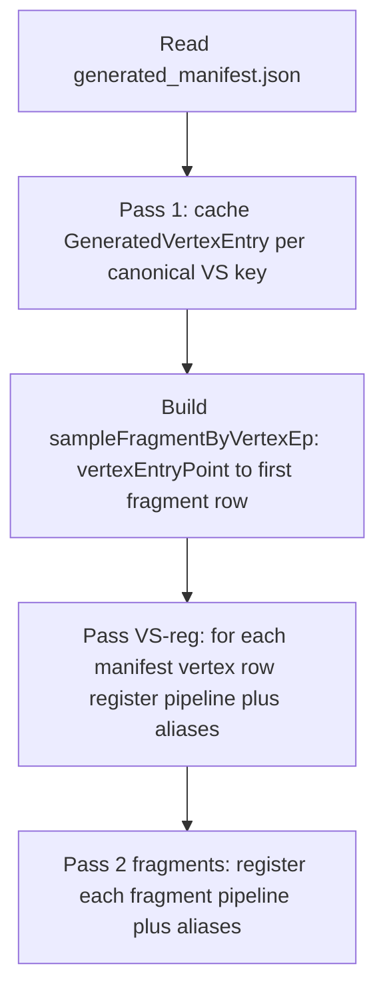

# Metal vertex manifest registration

Runtime architecture for registering **vertex-stage** manifest rows in `CMetalShaderManager::LoadGeneratedShaders` so engine logical names (via manifest `lookupAliases` and `Aliases.txt`) resolve for `EF_LoadShader` — including **`EF_SYSTEM`** loads such as `Decal_VP` / `Decal_2D_VP`.

Companion: [`metal-shader-load-fatal-resolution.md`](metal-shader-load-fatal-resolution.md), [`shader-aliases.md`](shader-aliases.md).

---

## Motivation

Generated **`generated_manifest.json`** contains both **vertex** and **fragment** rows. The Dart generator can attach **`lookupAliases`** to either stage (for example engine names normalized to `decal_vp` that map to vertex shader `cgvprogdecal`).

Originally, **only the fragment pass** performed:

- Loading VS + FS from `GeneratedShaders.metallib`
- Creating `MTLRenderPipelineState`
- Filling `ShaderInfo`
- Populating **`m_shaderNameMap`** and applying **`lookupAliases`**

Vertex-only manifest rows **never** executed that path, so **`lookupAliases` on vertex entries never reached `m_shaderNameMap`**. Any `EF_LoadShader("Decal_VP", …, EF_SYSTEM)` still normalized to `decal_vp` and aborted via **`ShaderLoadFatal`** even when the manifest listed the alias.

---

## Architecture: `LoadGeneratedShaders`

Implementation: [`RenderDll/XRenderMetal/MetalShaderLoader.mm`](../RenderDll/XRenderMetal/MetalShaderLoader.mm).

| Phase | Purpose |
| ----- | ------- |
| **Pass 1** | Cache vertex metadata (`m_generatedVertexEntries`, `vertexByFuncName`) so fragments can resolve paired vertex layout and Metal VS names. Unchanged conceptually. |
| **Pairing index** | Single forward scan of **non-vertex** rows: for each `vertexEntryPoint`, remember the **first** fragment row that references it. Keys are Metal VS function names (e.g. `generated_cgvprogdecal_vertex`). |
| **Vertex registration pass** | For each manifest row with `stage == "vertex"`: if its normalized name is not yet in `m_shaderNameMap`, resolve Metal VS name (`entryPoint` / `fragment` field), look up a **paired fragment** row, then register a full pipeline using the shared helper (below). **`lookupAliases`** for this registration come from the **vertex** row (via alias-source parameter). |
| **Fragment pass** | Same as before: each **fragment** row registers under its fragment **normalized** key; **`lookupAliases`** come from the fragment row. Implemented by calling the **same** helper as the vertex pass. |

Order matters: vertex registration runs **before** the fragment loop so names like `decal_vp` exist as soon as loading completes, consistent with any engine code that might resolve shaders early.

---

## Shared helper: `TryRegisterOneManifestPipeline`

Declared on [`CMetalShaderManager`](../RenderDll/XRenderMetal/MetalShaderManager.m) (protected), implemented in **`MetalShaderLoader.mm`**.

Parameters (conceptual):

| Input | Role |
| ----- | ---- |
| **Fragment manifest row** (`fragEntry`) | Authoritative for **FS**, uniforms, textures, directives, pipeline block, and **`vertexEntryPoint`** (Metal VS name). Used to load the fragment function and to derive function constants from the **fragment** shader name (matches generator pairing). |
| **Alias source row** (`aliasSourceOverride`, optional) | If present (vertex pass), **`lookupAliases`** are read from this row — typically the **vertex** manifest entry so engine-facing names attach to the vertex-normalized registration key. If `nil` (fragment pass), aliases are read from `fragEntry`. |
| **`registrationNormalizedKey`** | Primary key inserted into **`m_shaderNameMap`** and stored as **`ShaderInfo::name`**. For fragments this equals the fragment normalized name; for standalone vertex registration it equals the **vertex** normalized name (`cgvprogdecal`, etc.). |

Return values: **0** success, **1** skip (same as `continue` in the old loop), **2** fatal abort (mirror legacy early returns from shader load).

Behavior matches the previous inlined fragment loop: infer layout, load VS/FS from `GeneratedShaders.metallib` + Util vertex fallbacks when needed, **`CreatePipelineStateWithFunctions`**, allocate **`CMetalShader`**, fill bindings, then **`m_shaderNameMap[registrationNormalizedKey]`** and duplicate ids for each **`lookupAliases`** entry.

---

## Representative fragment pairing

Many **fragment** shaders can share the same **`vertexEntryPoint`**. The pairing map keeps only the **first** fragment row encountered when iterating the manifest array. That fragment supplies:

- The **fragment function** and **directives** used for Metal **function constants**
- **Pipeline** metadata (`blend`, depth, cull) applied to the PSO

So the **`ShaderInfo`** stored under the **vertex** normalized key is a **full** render pipeline (VS + FS). It is one valid representative for that VS; it is not necessarily the same fragment the game uses for every decal material path. This matches the needs of callers that load a vertex shader object by logical name (`Decal_VP`) and use it with leaf-buffer chunk binding in legacy CryEngine flows.

If no fragment references a vertex entry point, the vertex row is skipped (rate-limited log: no paired fragment for that Metal VS name).

---

## Tier alignment (`metal-shader-load-fatal-resolution.md`)

- **Tier 1** still means “present on `m_shaderNameMap` after **`LoadGeneratedShaders`**.” Vertex normalized keys and their **`lookupAliases`** are now eligible Tier-1 entries when the vertex registration pass succeeds.
- **Tier 2** (`Aliases.txt` → Dart **`manifestLookupAliasesForNormalizedFragment`** / vertex alias plumbing → manifest **`lookupAliases`**) remains the authoring path; the runtime change is **registration** of those aliases for **vertex** targets, not another alias tier.

---

## Related tools

| Tool | Notes |
| ---- | ----- |
| [`metal_pso_validate.md`](metal_pso_validate.md) | Validates **fragment** rows × metallib PSO creation; does not duplicate the engine’s vertex-registration pass, but a healthy manifest + metallib remains the compile gate. |
| **`metal_runtime_validate`** | Exercises full **`LoadGeneratedShaders`** including vertex registration when pointed at a directory containing **`GeneratedShaders.metallib`**, **`generated_manifest.json`**, and **`UtilShaders.metallib`**. |

---

## Source references

| Artifact | Location |
| -------- | -------- |
| Loader passes and helper | [`MetalShaderLoader.mm`](../RenderDll/XRenderMetal/MetalShaderLoader.mm) — `LoadGeneratedShaders`, `TryRegisterOneManifestPipeline` |
| Shader maps / `ShaderInfo` | [`MetalShaderManager.m`](../RenderDll/XRenderMetal/MetalShaderManager.m) |
| Manifest contract tests | [`RenderDll/XRenderMetal/test/RendererLogicTests.cpp`](../RenderDll/XRenderMetal/test/RendererLogicTests.cpp) (`hasLookupAlias` on manifest text) |
| Alias authoring | [`shader-aliases.md`](shader-aliases.md), [`tools/shader_port/lib/metal_generator.dart`](../tools/shader_port/lib/metal_generator.dart) |
